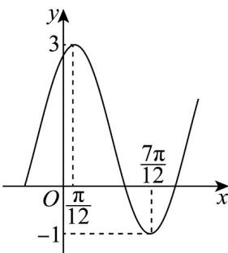

<!-- question-source:start -->
18. 已知函数 $f(x) = A \sin (\omega x + \varphi) + h$ （ $A > 0, \omega > 0, |\varphi| < \frac{\pi}{2}$ ）的部分图象如图所示

(1)求函数 $f(x)$ 的解析式；

(2)若 $0 < \beta < \alpha < \frac{\pi}{2}$ , $\cos (\alpha -\beta) = \frac{13}{14}$ , $f(\frac{\alpha}{2} +\frac{\pi}{12}) = \frac{9}{7}$ , 求 $\sin \beta$

(3)设 $g(x) = \frac{1}{2}\cos 2x + 2a\sin x - 1$ ，若对任意的 $x_{1} \in [-\frac{\pi}{2}, \frac{\pi}{2}]$ ， $x_{2} \in [-\frac{\pi}{6}, -\frac{\pi}{12}]$ ，都有 $\mathrm{g}(x_1) < f(x_2)$ ，求正实数 $a$ 的

取值范围·
<!-- question-source:end -->

![[高中/课堂同步/题库/人教A版高中数学同步讲义(2026)/01_必修第一册/第五章 三角函数/专题5.6 函数y＝Asin(ωx＋φ)（高效培优讲义）数学人教A版2019高一必修第一册/强化训练/questions/answers/Q00076459A1.md]]
