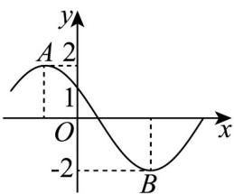
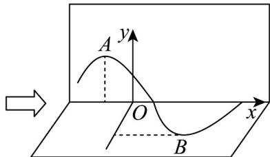

> [!faq]- 《专题5.6 函数y＝Asin(ωx＋φ)（高效培优讲义）数学人教A版2019高一必修第一册》官方解析
>
> > [!success]- **【答案】**   A. $\sqrt{3}$ B. 1 C. $-\sqrt{3}$ D. -2
>
> > [!note]- **【解析】**
> > 由函数 $f(x)$ 的图象过点 $(0,1)$ ，可得 $2\sin\varphi=1$ ，所以 $\sin\varphi=\frac{1}{2}$ ，又因为 $\frac{\pi}{2}<\varphi<\pi$ ，所以 $\varphi=\frac{5\pi}{6}$ ，所以 $f(x)=2\sin(\omega x+\frac{5\pi}{6})$ ，
> >
> > 又因为折叠后 $A, B$ 两点之间的距离为 $2\sqrt{3}$ ，所以 $\sqrt{2^2 + 2^2 + \left(\frac{1}{2}T\right)^2} = 2\sqrt{3}$ 解得 $T = 4$ ，所以 $\frac{2\pi}{\omega} = 4$ ，所以 $\omega = \frac{\pi}{2}$ ，所以 $f(x) = 2\sin \left(\frac{\pi}{2}x + \frac{5\pi}{6}\right)$ ，所以 $f\left(\frac{4}{3}\right) = 2\sin \left(\frac{\pi}{2} \times \frac{4}{3} + \frac{5\pi}{6}\right) = 2\sin \left(\frac{3\pi}{2}\right) = -2$ 。
> >
> > 故选：D.
> >
> > 3. 要得到函数 $y = \cos(2x + \pi)$ 的图象，只需要将函数 $y = \cos 2x$ 的图象（）
> >
> > 【答案】
> > A. 向左平移 $\pi$ 个单位
> > B. 向右平移 $\pi$ 个单位
> > C. 向左平移 $\frac{\pi}{2}$ 个单位
> > D. 向右平移 $\frac{\pi}{3}$ 个单位
> >
> > 【答案】C
> >
> > 【详解】对于 A，由诱导公式得 $y = \cos 2(x + \pi) = \cos(2x + 2\pi) = \cos 2x$ ，故 A 错误，
> > 对于 B，由诱导公式得 $y = \cos 2(x - \pi) = \cos(2x - 2\pi) = \cos 2x$ ，故 B 错误，
> > 对于 C，由诱导公式得 $y = \cos 2(x + \frac{\pi}{2}) = \cos(2x + \pi)$ ，故 C 正确，
> > 对于 D，由诱导公式得 $y = \cos 2\left(x - \frac{\pi}{3}\right) = \cos\left(2x - \frac{2\pi}{3}\right)$ ，故 D 错误.
> >
> > 故选：C
> >
> > 4. 将函数 $f(x)=2\sin\left(2x+\frac{\pi}{3}\right)$ 的图象向右平移 $\frac{\pi}{4}$ 个单位，得到函数 $g(x)$ 的图象，则下列判断错误的是
> >
> > 【答案】
> > () A. 函数 $g\left(x+\frac{\pi}{12}\right)$ 是奇函数 B. $g(x)$ 在 $\left[-\frac{\pi}{12},\frac{\pi}{4}\right]$ . 上单调递增 C. $g(x)$ 的图象关于直线 $x=-\frac{\pi}{6}$ 对称 D. $g(x)$ 在 $\left[-\frac{\pi}{6},\frac{\pi}{2}\right)$ 上的值域为 [1,2]
> >
> > 【答案】D
> >
> > 【详解】函数 $f(x)=2\sin\left(2x+\frac{\pi}{3}\right)$ 的图象向右平移 $\frac{\pi}{4}$ 个单位，得到函数 $g(x)$ 的图象，
> >
> > 故 $g(x)=2\sin\left[2\left(x-\frac{\pi}{4}\right)+\frac{\pi}{3}\right]=2\sin\left(2x-\frac{\pi}{6}\right)$ ;
> >
> > 对于 $\mathsf{A}$ ， $g\left(x + \frac{\pi}{12}\right) = 2\sin 2x$ ，故 $g\left(x + \frac{\pi}{12}\right) + g\left(-x + \frac{\pi}{12}\right) = 2\sin 2x + 2\sin (-2x) = 0$
> >
> > 则函数 $g\left(x+\frac{\pi}{12}\right)$ 是奇函数，故 A 正确；
> >
> > 对于 B，当 $x \in \left[-\frac{\pi}{12}, \frac{\pi}{4}\right]$ 时， $\left(2x - \frac{\pi}{6}\right) \in \left[-\frac{\pi}{3}, \frac{\pi}{3}\right]$ ，故 $g(x) = 2 \sin \left(2x - \frac{\pi}{6}\right)$ 在 $\left[-\frac{\pi}{12}, \frac{\pi}{4}\right]$ 上单调递增，故 B 正确；
> >
> > 对于 C，当 $x = -\frac{\pi}{6}$ 时， $2x - \frac{\pi}{6} = -\frac{\pi}{2}$ ，故 $g(x) = 2\sin\left(2x - \frac{\pi}{6}\right)$ 的图象关于直线 $x = -\frac{\pi}{6}$ 对称，故 C 正确；
> >
> > 对于 D，当 $x \in \left[-\frac{\pi}{6}, \frac{\pi}{2}\right)$ 时， $2x - \frac{\pi}{6} \in \left[-\frac{\pi}{2}, \frac{5\pi}{6}\right]$ ，故 $g(x) = 2\sin\left(2x - \frac{\pi}{6}\right) \in [-2, 2]$ ，故 D 错误.
> >
> > 故选 **D**
