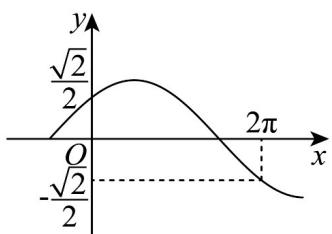
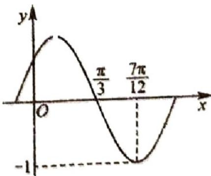

> [!faq]- 《专题5.6 函数y＝Asin(ωx＋φ)（高效培优讲义）数学人教A版2019高一必修第一册》官方解析
>
> > [!success]- **【答案】**  A. 2 B. 1 C. $\frac{1}{2}$ D. $\frac{1}{4}$
>
> > [!note]- **【解析】**
> > 由图知， $f(x)$ 图象过点 $\left(0,\frac{\sqrt{2}}{2}\right),\left(2\pi,-\frac{\sqrt{2}}{2}\right)$
> >
> > 所以 $f(0) = \sin \varphi = \frac{\sqrt{2}}{2}$ ，又 $\left|\varphi\right| < \frac{\pi}{2}$ ，所以 $\varphi = \frac{\pi}{4}$
> >
> > 又点 $\left(2\pi, -\frac{\sqrt{2}}{2}\right)$ 在函数 $f(x)$ 的减区间内，由 $f(2\pi) = \sin \left(2\omega \pi + \frac{\pi}{4}\right) = -\frac{\sqrt{2}}{2}$ ，
> >
> > 得到 $2\omega \pi + \frac{\pi}{4} = \frac{5\pi}{4} + 2k\pi, k \in \mathbb{Z}$ ，所以 $\omega = \frac{1}{2} + k, k \in \mathbb{Z}$
> >
> > 令 $k = 0$ ，得到 $\omega = \frac{1}{2}$ ，结合各个选项可知，C正确，其它选项不满足 $\omega = \frac{1}{2} + k, k \in \mathbb{Z}$
> >
> > 故选：C.
> >
> > 6. 将函数 $f(x) = a \sin 2x + 2\cos 2x$ 的图象沿 $x$ 轴向右平移 $\frac{\pi}{6}$ 个单位后得到的图象关于原点对称，则实数 $a$ 的
> >
> > 值为（ ）A. $2\sqrt{3}$ B. $\frac{2\sqrt{3}}{3}$ C. $-\frac{2\sqrt{3}}{3}$ D. $-2\sqrt{3}$
> >
> > 【答案】B
> >
> > 【详解】由题意可知 $a \neq 0$ ，设 $\tan \varphi = \frac{2}{a}$ ，则 $f(x) = \sqrt{a^2 + 4} \sin (2x + \varphi)$
> >
> > 设将函数 $f(x)$ 的图象向右平移 $\frac{\pi}{6}$ 个单位可得函数 $g(x)$ 的图象，
> >
> > 则 $g(x) = f\left(x - \frac{\pi}{6}\right) = \sqrt{a^2 + 4}\sin \left(2x - \frac{\pi}{3} +\varphi\right)$
> >
> > 易知 $g(0) = 0$ ，则 $-\frac{\pi}{3} +\varphi = k\pi (k\in Z)$ ，即 $\varphi = \frac{\pi}{3} +k\pi (k\in Z)$
> >
> > 可得 $\tan\varphi=\sqrt{3}=\frac{2}{a}$ ，解得 $a=\frac{2\sqrt{3}}{3}$
> >
> > 故选：B.
> >
> > 7. 函数 $f(x) = A\sin (\omega x + \varphi)(A > 0, \omega > 0)$ 的图象如图所示，为了得到 $g(x) = A\sin \left(\omega x - \frac{\pi}{2}\right)$ 的图象，可以将
> >
> > $f(x)$ 的图象（）
> >
> > 
> >
> > A. 向右平移 $\frac{\pi}{12}$ 个单位长度 B. 向右平移 $\frac{5\pi}{12}$ 个单位长度 C. 向左平移 $\frac{\pi}{12}$ 个单位长度 D. 向左平移 $\frac{5\pi}{12}$ 个单位长度
> >
> > 【答案】B
> >
> > 【详解】由题意可得 $\frac{T}{4} = \frac{7\pi}{12} -\frac{\pi}{3} = \frac{\pi}{4}$ ，解得 $T = \pi$ ，所以 $\omega = \frac{2\pi}{T} = 2$ ，由图可知 $f\left(\frac{7\pi}{12}\right) = A\sin \left(\frac{7\pi}{6} +\varphi\right) = -A$ ，所以 $\frac{7\pi}{6} +\varphi = \frac{3}{2}\pi +2k\pi ,k\in Z$ 解得 $\varphi = \frac{1}{3}\pi +2k\pi ,k\in Z$ ，所以 $f(x) = A\sin \left(2x + \frac{1}{3}\pi +2k\pi\right) = A\sin \left(2x + \frac{\pi}{3}\right),k\in Z$
> >
> > $$
> > g (x) = A \sin \left(\omega x - \frac {\pi}{2}\right) = A \sin \left(2 x - \frac {\pi}{2}\right)
> > $$
> >
> > 注意到 $f\left(x - \frac{5\pi}{12}\right) = A\sin \left[2\left(x - \frac{5\pi}{12}\right) + \frac{\pi}{3}\right] = A\sin \left(2x - \frac{\pi}{2}\right)$
> >
> > 所以为了得到 $g(x)=A\sin\left(\omega x-\frac{\pi}{2}\right)$ 的图象，可以将 $f(x)$ 的图象向右平移 $\frac{5\pi}{12}$ 个单位长度.
> >
> > 故选：B.
> >
> > 8. 将函数 $y = \sin x - \sqrt{3} \cos x$ 的图象上所有点的横坐标变为原来的 $\frac{1}{2}$ ，再将图象向左平移 $\varphi$ 个单位长度后，得到的函数图象关于 $y$ 轴对称，其中 $0 < \varphi < \frac{\pi}{2}$ ，则 $\varphi = (\quad)$ A. $\frac{5\pi}{12}$ B. $\frac{\pi}{12}$ C. $\frac{\pi}{3}$ D. $\frac{\pi}{6}$
> >
> > 【答案】A
> >
> > 【详解】 $y = \sin x - \sqrt{3}\cos x = 2\left(\frac{1}{2}\sin x - \frac{\sqrt{3}}{2}\cos x\right) = 2\sin \left(x - \frac{\pi}{3}\right)$ ，经过两次变换后，新函数的解析式为 $y = 2 \sin \left( 2x + 2\varphi - \frac{\pi}{3} \right)$ .
> >
> > 因为新函数图象关于 y 轴对称，所以 $2\varphi - \frac{\pi}{3} = \frac{\pi}{2} + k\pi (k \in \mathbb{Z})$ ，所以 $\varphi = \frac{5\pi}{12} + \frac{k\pi}{2}(k \in \mathbb{Z})$
> >
> > 因为 $0 < \varphi < \frac{\pi}{2}$ ，所以 $\varphi = \frac{5\pi}{12}$ .
> >
> > 故选 **A**.
