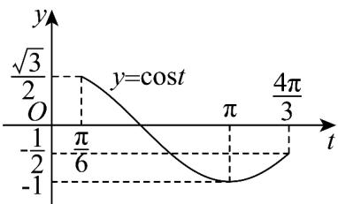

> [!faq]- 《专题5.6 函数y＝Asin(ωx＋φ)（高效培优讲义）数学人教A版2019高一必修第一册》官方解析
>
> > [!success]- **【答案】** C
>
> > [!note]- **【解析】**
> > $f(x) = \sqrt{3}\sin \left(x - \frac{\pi}{3}\right) - \cos \left(x - \frac{\pi}{3}\right) = 2\sin \left(x - \frac{\pi}{3} -\frac{\pi}{6}\right) = -2\cos x$
> >
> > 则 $f(2x) = -2\cos 2x$
> >
> > 将 $y = f(2x)$ 向左平移 $\frac{\pi}{12}$ 个单位，得： $-2\cos \left[2\left(x + \frac{\pi}{12}\right)\right] = -2\cos \left(2x + \frac{\pi}{6}\right)$
> >
> > 再向上平移1个单位，得 $g(x) = -2 \cos \left(2x + \frac{\pi}{6}\right) + 1$
> >
> > 当 $x \in \left[0, \frac{7\pi}{12}\right]$ 时，令 $t = 2x + \frac{\pi}{6}$ ，则 $t \in \left[\frac{\pi}{6}, \frac{4\pi}{3}\right]$
> >
> > 方程 $g(x)=m$ 即 $\cos t=\frac{1-m}{2}$
> >
> > 作出函数 $y = \cos t$ 在 $t \in \left[\frac{\pi}{6}, \frac{4\pi}{3}\right]$ 的图象：
> >
> > 要使 $\cos t = \frac{1 - m}{2}$ 有两个解，结合图象可知 $\frac{1 - m}{2} \in (-1, -\frac{1}{2}]$ ，解得 $2 \leq m < 3$ ，
> > 因此，当 $m \in [2, 3)$ 时， $g(x) = m$ 有两个不等实根·
> >
> > 故选：C.
> >
> > 
