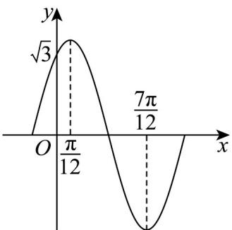
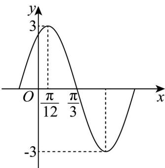

> [!faq]- 《专题5.6 函数y＝Asin(ωx＋φ)（高效培优讲义）数学人教A版2019高一必修第一册》官方解析
>
> > [!success]- **【答案】** A. 函数 $f(x)$ 的最小正周期为 $\pi$ B. 函数 $f(x)$ 的对称轴方程为 $x = \frac{k\pi}{2} + \frac{\pi}{3} (k \in \mathbb{Z})$ C. 函数 $f(x)$ 在区间 $\left[\frac{5\pi}{6}, \frac{4\pi}{3}\right]$ 上单调递减 D. 将函数 $f(x)$ 的图象向左平移 $\frac{\pi}{3}$ 个单位，所得函数为偶函数
>
> > [!note]- **【解析】**
> > A选项， $f(x)=\sqrt{3}\sin2x-\cos2x=2\sin\left(2x-\frac{\pi}{6}\right)$
> >
> > 所以 $f(x)$ 的最小正周期为 $\frac{2\pi}{2} = \pi$ ，A 正确；
> >
> > B 选项，令 $2x - \frac{\pi}{6} = \frac{\pi}{2} + k\pi, k \in Z$ ，解得 $x = \frac{\pi}{3} + \frac{k\pi}{2}, k \in Z$ ，B 正确；
> >
> > C 选项， $x \in \left[\frac{5\pi}{6}, \frac{4\pi}{3}\right]$ 时， $2x - \frac{\pi}{6} \in \left[\frac{3\pi}{2}, \frac{5\pi}{2}\right]$
> >
> > 因为 $y = 2 \sin z$ 在 $z \in \left[\frac{3\pi}{2}, \frac{5\pi}{2}\right]$ 上单调递增，
> >
> > 所以 $f(x)$ 在区间 $\left[\frac{5\pi}{6}, \frac{4\pi}{3}\right]$ 上单调递增，C 错误；
> >
> > D 选项，函数 $f(x)$ 的图象向左平移 $\frac{\pi}{3}$ 个单位，
> >
> > 得到 $h(x)=2\sin\left(2x+\frac{2\pi}{3}-\frac{\pi}{6}\right)=2\sin\left(2x+\frac{\pi}{2}\right)=2\cos2x$
> >
> > 由于 $h(-x)=2\cos(-2x)=2\cos2x=h(x)$ ，
> >
> > 故 $h(x)$ 为偶函数，D正确.
> >
> > 故选：ABD
> >
> > 12. 函数 $f(x) = A \sin (\omega x + \varphi)$ （ $A > 0, \omega > 0, 0 < \varphi < \pi$ ）在一个周期内的图象如图所示，且函数 $f(x)$ 过点 $(0,\sqrt{3})$ ，则（）
> >
> > 【答案】
> >
> > 
> >
> > A. $\omega = 1$ B. $\varphi = \frac{\pi}{3}$
> >
> > C. $f(x)$ 在区间 $\left[-\frac{5\pi}{12}, \frac{\pi}{12}\right]$ 上单调递增 D. $f\left(x - \frac{\pi}{3}\right)$ 为奇函数
> >
> > 【答案】BC
> >
> > 【详解】由图象可知： $\frac{T}{2} = \frac{7\pi}{12} -\frac{\pi}{12} = \frac{\pi}{2}$ ，所以 $T = \pi$
> >
> > 由 $T=\frac{2\pi}{\omega}=\pi\Rightarrow\omega=2$ ，故 A 选项错误；
> >
> > 由图象可知： $f\left(\frac{\frac{7\pi}{12} + \frac{\pi}{12}}{2}\right) = f\left(\frac{\pi}{3}\right) = 0$
> >
> > 即 $A\sin \left(2\times \frac{\pi}{3} +\varphi\right) = 0$ ，所以 $\frac{2\pi}{3} +\varphi = k\pi (k\in Z)$
> >
> > 解得： $\varphi = k\pi -\frac{2\pi}{3}\bigl (k\in Z\bigr)$
> >
> > 又 $0 < \varphi < \pi$ ，所以 $\varphi = \frac{\pi}{3}$ ，故 B 选项正确；
> >
> > 因为函数 $f(x)$ 过点 $(0, \sqrt{3})$ ，所以 $A \sin \frac{\pi}{3} = \sqrt{3} \Rightarrow A = 2$
> >
> > 所以函数 $f(x) = 2\sin \left(2x + \frac{\pi}{3}\right)$
> >
> > 由 $-\frac{5\pi}{12} \leq x \leq \frac{\pi}{12}$ ，所以 $-\frac{\pi}{2} \leq 2x + \frac{\pi}{3} \leq \frac{\pi}{2}$ ，
> >
> > 又 $y = \sin t$ 在 $\left[-\frac{\pi}{2}, \frac{\pi}{2}\right]$ 上单调递增，
> >
> > 故 $f(x)$ 在区间 $\left[-\frac{5\pi}{12}, \frac{\pi}{12}\right]$ 上单调递增，
> >
> > 故 $^{C}$ 选项正确；
> >
> > 因为 $f(x) = 2\sin \left(2x + \frac{\pi}{3}\right)$
> >
> > 所以 $f\left(x-\frac{\pi}{3}\right)=2\sin\left[2\left(x-\frac{\pi}{3}\right)+\frac{\pi}{3}\right]=2\sin\left(2x-\frac{\pi}{3}\right)$
> >
> > 令 $g(x) = 2\sin \left(2x - \frac{\pi}{3}\right)$
> >
> > 由 $g(x)$ 的定义域为 R 关于坐标原点对称
> >
> > 但是 $g(-x) = 2\sin \left(-2x - \frac{\pi}{3}\right) = -2\sin \left(2x + \frac{\pi}{3}\right)\neq -g(x)$
> >
> > 所以 $g(x)$ 不是奇函数，即函数 $f\left(x-\frac{\pi}{3}\right)$ 不是奇函数，
> >
> > 故 $^{D}$ 选项不正确·
> >
> > 故选：BC.
> >
> > 13. 函数 $f(x) = A \sin (\omega x + \varphi) \left( A > 0, \omega > 0, |\varphi| < \frac{\pi}{2} \right)$ 的部分图象如图所示，则下列说法正确的是（）
> >
> > 【答案】
> >
> > 
> >
> > A. $f(x)$ 的最小正周期为 $\pi$
> >
> > B. $f(x)$ 在 $\left[-\frac{\pi}{2}, -\frac{\pi}{4}\right]$ 上单调递减
> >
> > C. 直线 $x = -\frac{11\pi}{12}$ 为 $f(x)$ 的一条对称轴
> >
> > D．若 $f(x + \theta)$ 为偶函数，则 $\theta = \frac{k\pi}{2} +\frac{\pi}{12},k\in \mathbf{Z}$
> >
> > 【答案】ACD
> >
> > 【详解】由图可知： $A = 3$ ， $\frac{T}{4} = \frac{\pi}{3} -\frac{\pi}{12} = \frac{\pi}{4}\Rightarrow T = \pi$ ，则 $\pi = \frac{2\pi}{\omega}\Rightarrow \omega = 2$
> >
> > 当 $x=\frac{\pi}{12}$ 时，函数取得最大值，所以 $2\times\frac{\pi}{12}+\varphi=\frac{\pi}{2}+2k\pi,\quad k\in\mathbb{Z}$ ，又 $\left|\varphi\right|<\frac{\pi}{2}$ ，所以 $\varphi=\frac{\pi}{3}$
> >
> > 所以 $f(x)=3\sin\left(2x+\frac{\pi}{3}\right)$ .
> >
> > 对 A， $f(x)$ 的最小正周期为 $\pi$ ，正确；
> >
> > 对 B， $x \in \left[-\frac{\pi}{2}, -\frac{\pi}{4}\right]$ ，令 $t = 2x + \frac{\pi}{3}$ ，则 $t \in \left[-\frac{2\pi}{3}, -\frac{\pi}{6}\right]$ ，可知 $y = 3\sin t$ 在 $\left[-\frac{2\pi}{3}, -\frac{\pi}{6}\right]$ 不是单调的，故错误；
> >
> > 对 $C$ ，由 $x = -\frac{11\pi}{12}$ ，所以 $2x + \frac{\pi}{3} = -\frac{3\pi}{2}$ ，所以 $f(x)$ 取得最小值-3，直线 $x = -\frac{11\pi}{12}$ 为 $f(x)$ 的一条对称轴，故正
> >
> > 确；
> >
> > 对 D， $f(x+\theta)=3\sin\left(2x+2\theta+\frac{\pi}{3}\right)$ 为偶函数，所以 $2\theta+\frac{\pi}{3}=\frac{\pi}{2}+k\pi\Rightarrow\theta=\frac{k\pi}{2}+\frac{\pi}{12}, k\in\mathbf{Z}$ ，故正确·
> >
> > 故选 **ACD**.
