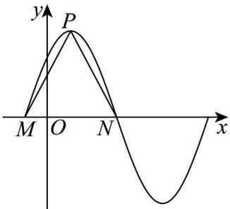

<!-- question-source:start -->
【典例1】已知函数 $f(x) = A\sin (\omega x + \varphi)$ （其中 $A > 0, \omega > 0, |\varphi| < \frac{\pi}{2}$ ）的部分图象如图所示，点 $M, N$ 是函数图象与 $x$ 轴的交点，点 $P$ 是函数图象的最高点，且 $\triangle PMN$ 是边长为 $^{2}$ 的正三角形， $ON = 3OM$ ，则 $f(x) = A\sin (\omega x + \varphi)$ 的解析式可以是（）

A. $f(x)=\sqrt{3}\sin\left(\frac{\pi}{2}x+\frac{\pi}{4}\right)$ B. $f(x)=2\sin\left(\frac{\pi}{2}x+\frac{\pi}{3}\right)$ C. $f(x)=\sqrt{3}\sin\left(\frac{\pi}{2}x+\frac{\pi}{3}\right)$ D. $f(x)=\sqrt{3}\sin\left(\pi x+\frac{\pi}{4}\right)$
<!-- question-source:end -->

![[高中/课堂同步/题库/人教A版高中数学同步讲义(2026)/01_必修第一册/第五章 三角函数/专题5.6 函数y＝Asin(ωx＋φ)（高效培优讲义）数学人教A版2019高一必修第一册/题型01_根据函数图象求解析式/questions/answers/Q00076426A1.md]]
