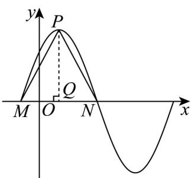

> [!faq]- 《专题5.6 函数y＝Asin(ωx＋φ)（高效培优讲义）数学人教A版2019高一必修第一册》官方解析
>
> > [!success]- **【答案】** A
>
> > [!note]- **【解析】**
> > 
> >
> > 过点 $P$ 作 $x$ 轴的垂线，垂足为 $Q$ ，则 $Q$ 为 $MN$ 的中点，$\because \triangle PMN$ 是边长为 $^2$ 的正三角形， $ON = 3OM$
> >
> > $$
> > \therefore M \left(- \frac {1}{2}, 0\right), N \left(\frac {3}{2}, 0\right), P Q = \sqrt {3}, \therefore P \left(\frac {1}{2}, \sqrt {3}\right), \therefore A = \sqrt {3}
> > $$
> >
> > 又 T = 2MN = 4，∴ $\frac{2\pi}{\omega} = 4$ ，解得 $\omega = \frac{\pi}{2}$ ，
> >
> > $$
> > \therefore f (x) = \sqrt {3} \sin \left(\frac {\pi}{2} x + \varphi\right)
> > $$
> >
> > 将点 $P\left(\frac{1}{2},\sqrt{3}\right)$ 代入得 $f\left(\frac{1}{2}\right) = \sqrt{3}\sin \left(\frac{\pi}{2} \times \frac{1}{2} +\varphi\right) = \sqrt{3}$ $\therefore \frac{\pi}{4} +\varphi = \frac{\pi}{2} +2k\pi ,k\in \mathbf{Z}$
> >
> > $$
> > \therefore \varphi = \frac {\pi}{4} + 2 k \pi , k \in \mathbf {Z} \quad \because | \varphi | <   \frac {\pi}{2} \quad \therefore \varphi = \frac {\pi}{4}
> > $$
> >
> > $$
> > \therefore f (x) = \sqrt {3} \sin \left(\frac {\pi}{2} x + \frac {\pi}{4}\right).
> > $$
> >
> > 故选：A.
> >
> > ## 方法技巧
> >
> > 确定函数 $y = A\sin (\omega x + \varphi) + B$ （ $A > 0, \omega > 0$ ）的解析式的步骤
> >
> > (1) 求 A, B，确定函数的最大值 M 和最小值 m，则 $A = \frac{M - m}{2}$ ， $B = \frac{M + m}{2}$
> >
> > (2) 求 $\omega$ ，确定函数的周期 T，则 $\omega = \frac{2\pi}{T}$
> >
> > (3) 求 $\varphi$ ，常用方法有
> > - **①**：代入法：把图象上的一个已知点代入（此时要注意该点在上升区间上还是在下降区间上）或把图象的最高点或最低点代入。
> > - **②**：五点法：确定 $\varphi$ 值时，往往以寻找“五点法”中的特殊点作为突破口。
