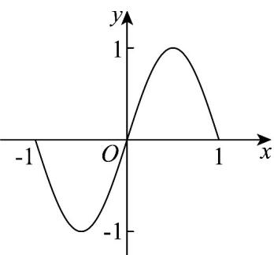
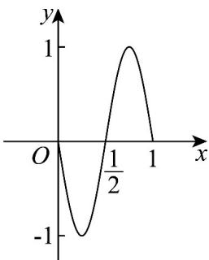

> [!faq]- 《专题5.6 函数y＝Asin(ωx＋φ)（高效培优讲义）数学人教A版2019高一必修第一册》官方解析
>
> > [!success]- **【答案】**   图1 图2 A. $y = f\left(2x - \frac{1}{2}\right)$ B. $y = f\left(\frac{x}{2} - \frac{1}{2}\right)$ C. $y = f\left(\frac{x}{2} - 1\right)$ D. $y = f(2x - 1)$
>
> > [!note]- **【解析】**
> > 若 $f(x)=\sin\pi x$
> >
> > $$
> > f \left(2 x - \frac {1}{2}\right) = \sin \left(2 \pi x - \frac {\pi}{2}\right) = - \cos 2 \pi x, f \left(\frac {x}{2} - \frac {1}{2}\right) = \sin \left(\frac {\pi}{2} x - \frac {\pi}{2}\right) = - \cos \frac {\pi}{2} x
> > $$
> >
> > $$
> > f \left(\frac {x}{2} - 1\right) = \sin \left(\frac {\pi}{2} x - \pi\right) = - \sin \frac {\pi}{2} x, f (2 x - 1) = \sin (2 \pi x - \pi) = - \sin 2 \pi x
> > $$
> >
> > 由已知图象可知，右图的周期是左图函数周期的 $\frac{1}{2}$ ，从而可排除选项 B，C；
> >
> > 对于选项 A， $f\left(2x-\frac{1}{2}\right)=-\cos2\pi x$ ，当 x=0 时函数值为 -1，从而排除选项 A.
> >
> > 故选 **D**.
