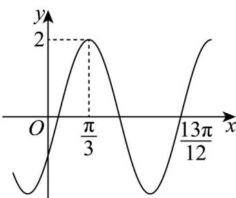

> [!faq]- 《专题5.6 函数y＝Asin(ωx＋φ)（高效培优讲义）数学人教A版2019高一必修第一册》官方解析
>
> > [!success]- **【答案】**  ①函数 $f(x)$ 的图象关于点 $\left(\frac{\pi}{6},0\right)$ 对称： ②函数 $f(x)$ 的解析式可以为 $f(x)=2\cos\left(2x-\frac{2\pi}{3}\right)$ ; ③函数 $f(x)$ 在 $\left(\frac{\pi}{12},\frac{13\pi}{24}\right)$ 上的值域为[0,2]； ④若将 $f(x)$ 图象上所有点的横坐标缩短为原来的 $\frac{2}{3}$ 倍，纵坐标不变，再向右平移 $\frac{\pi}{12}$ 个单位，则所得函数的解析式为是 $y = 2\sin \left(3x + \frac{\pi}{12}\right)$ . A.1 B.2 C.3 D.4
>
> > [!note]- **【解析】**
> > 由已知 $A = 2$ ， $T = \left(\frac{13}{12}\pi -\frac{\pi}{3}\right)\times \frac{4}{3} = \pi$ ∴ $\omega = \frac{2\pi}{T} = 2$
> >
> > $2 \times \frac{\pi}{3} + \varphi = 2k\pi + \frac{\pi}{2}, k \in \mathbb{Z}$ 又 $|\varphi| < \pi, \therefore \varphi = -\frac{\pi}{6}$ ,
> >
> > $$
> > \therefore f (x) = 2 \sin \left(2 x - \frac {\pi}{6}\right)
> > $$
> >
> > $f(\frac{\pi}{6}) = 2\sin (2\times \frac{\pi}{6} -\frac{\pi}{6}) = 1\neq 0$ ，①错；
> >
> > 又 $f(x) = 2\sin \left(2x - \frac{\pi}{6}\right) = 2\cos \left[\frac{\pi}{2} -\left(2x - \frac{\pi}{6}\right)\right] = 2\cos \left(\frac{2\pi}{3} -2x\right) = 2\cos \left(2x - \frac{2\pi}{3}\right)$ ，②正确；
> >
> > $x\in\left(\frac{\pi}{12},\frac{13\pi}{24}\right)$ 时， $2x-\frac{\pi}{6}\in(0,\frac{11\pi}{12})$ ，因此 $f(x)\in(0,2]$ ，③错误；
> >
> > 若将 $f(x)$ 图象上所有点的横坐标缩短为原来的 $\frac{2}{3}$ 倍，纵坐标不变，得 $y = 2\sin \left(3x - \frac{\pi}{6}\right)$ 的图象，再向右平移
> >
> > $\frac{\pi}{12}$ 个单位，则所得函数的解析式为是 $y = 2\sin\left[3(x - \frac{\pi}{12}) - \frac{\pi}{6}\right] = 2\sin\left(3x - \frac{5\pi}{12}\right)$ ，④错，
> >
> > 所以正确的只有一个，
> >
> > 故选 **A**.
