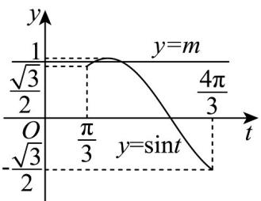

> [!faq]- 《专题5.6 函数y＝Asin(ωx＋φ)（高效培优讲义）数学人教A版2019高一必修第一册》官方解析
>
> > [!success]- **【答案】** (1) $f(x)$ 的单调递增区间为 $\left[-\frac{5\pi}{12}+k\pi,\frac{\pi}{12}+k\pi\right],k\in Z$ (2)实数 $m$ 的取值范围 $\left[\frac{\sqrt{3}}{2},1\right)$
>
> > [!note]- **【解析】**
> > （1） $f(x)=\sqrt{3}\cos^{2}\omega x+\sin\omega x\cos\omega x-\frac{\sqrt{3}}{2}=\frac{\sqrt{3}}{2}(1+\cos2\omega x)+\frac{1}{2}\sin2\omega x-\frac{\sqrt{3}}{2}$
> >
> > $$
> > = \frac {\sqrt {3}}{2} \cos 2 \omega x + \frac {1}{2} \sin 2 \omega x = \sin \frac {\pi}{3} \cos 2 \omega x + \cos \frac {\pi}{3} \sin 2 \omega x = \sin \left(2 \omega x + \frac {\pi}{3}\right), (\omega > 0),
> > $$
> >
> > 因为 $y = f(x)$ 图象的相邻对称轴之间的距离为 $\frac{\pi}{2}$ ，所以 $y = f(x)$ 的最小正周期为 $\pi$ ，
> >
> > 所以 $\frac{2\pi}{2\omega} = \pi$ ，得 $\omega = 1$ ，所以 $f(x) = \sin \left(2x + \frac{\pi}{3}\right)$
> >
> > 令 $-\frac{\pi}{2} + 2k\pi \leq 2x + \frac{\pi}{3} \leq \frac{\pi}{2} + 2k\pi, k \in \mathbb{Z}$
> >
> > 则 $-\frac{5\pi}{12} + k\pi \leq x \leq \frac{\pi}{12} + k\pi, k \in \mathbb{Z}$
> >
> > 所以 $f(x)$ 的单调递增区间为 $\left[-\frac{5\pi}{12} + k\pi, \frac{\pi}{12} + k\pi\right], k \in Z$
> >
> > (2) 由 (1) 知 $f(x) = \sin \left(2x + \frac{\pi}{3}\right)$ ，将 $f(x)$ 图象上所有点的横坐标缩短为原来的 $\frac{1}{2}$
> >
> > 得到函数 $y = \sin\left(4x + \frac{\pi}{3}\right)$ 的图象，
> >
> > 再向左平移 $\frac{\pi}{12}$ 个单位得 $g(x) = \sin \left[4\left(x + \frac{\pi}{12}\right) + \frac{\pi}{3}\right] = \sin \left(4x + \frac{2\pi}{3}\right)$ 的图象.
> >
> > 令 $t = 4x + \frac{2\pi}{3}$ ， $x\in \left[-\frac{\pi}{12},\frac{\pi}{6}\right]$ ，则 $t\in \left[\frac{\pi}{3},\frac{4\pi}{3}\right]$ ，所以 $\sin t\in \left[-\frac{\sqrt{3}}{2},1\right]$
> >
> > 所以 $y = \sin t$ ， $t\in \left[\frac{\pi}{3},\frac{4\pi}{3}\right]$ 与 $y = m$ 有两个交点，
> >
> > 作出 $y = \sin t$ ， $t\in \left[\frac{\pi}{3},\frac{4\pi}{3}\right]$ 的图象如图所示，所以 $\frac{\sqrt{3}}{2}\leq m < 1$
> >
> > 所以实数 $m$ 的取值范围 $\left[\frac{\sqrt{3}}{2}, 1\right)$ .
> >
> > 
