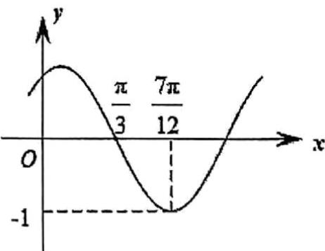

<!-- question-source:start -->
【变式2】已知函数 $f(x) = A\sin (\omega x + \varphi)$ （其中 $A > 0$ ， $|\varphi| < \frac{\pi}{2}$ ）的图象如图所示。

(1)求函数 $f(x)$ 的解析式；

(2)若将函数 $y = f(x)$ 的图象上的所有点的纵坐标不变，横坐标伸长到原来的 $^{3}$ 倍，得到函数 $g(x)$ 的图象，求

函数 $y = g(x)$ 的单调递增区间.
<!-- question-source:end -->

![[高中/课堂同步/题库/人教A版高中数学同步讲义(2026)/01_必修第一册/第五章 三角函数/专题5.6 函数y＝Asin(ωx＋φ)（高效培优讲义）数学人教A版2019高一必修第一册/题型05_由图象变换研究函数的性质/questions/answers/Q00076443A1.md]]
