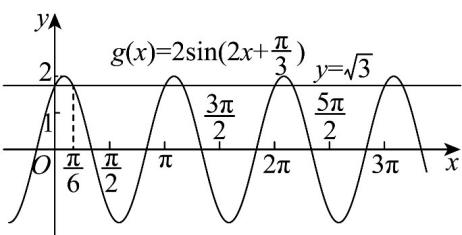

> [!faq]- 《专题5.6 函数y＝Asin(ωx＋φ)（高效培优讲义）数学人教A版2019高一必修第一册》官方解析
>
> > [!success]- **【答案】** B
>
> > [!note]- **【解析】**
> > 因为 $f\left(x - \frac{\pi}{3}\right) = 2\sin \left[4\left(x - \frac{\pi}{3}\right) - \frac{\pi}{3}\right] = 2\sin \left(4x - \frac{5\pi}{3}\right) = 2\sin \left(4x - \frac{5\pi}{3} + 2\pi\right) = 2\sin \left(4x + \frac{\pi}{3}\right)$
> >
> > 所以 $f(x)$ 向右移 $\frac{\pi}{3}$ 个单位得函数解析式为 $y = 2\sin \left(4x + \frac{\pi}{3}\right)$
> >
> > 又 $y = 2 \sin \left(4x + \frac{\pi}{3}\right)$ 图象上每个点的横坐标变为原来的 2 倍，得到函数 $g(x)$ 的图象，
> >
> > 所以 $g(x)=2\sin\left(2x+\frac{\pi}{3}\right)$
> >
> > 对于 A，因为 $g\left(\frac{\pi}{3}\right)=2\sin\left(2\times\frac{\pi}{3}+\frac{\pi}{3}\right)=2\sin\pi=0$ ，所以直线 $x=\frac{\pi}{3}$ 不是 $g(x)$ 图象的对称轴，故 A 错误；
> >
> > 对于 B，因为 $g(0)=2\sin\frac{\pi}{3}=\sqrt{3}, g\left(\frac{\pi}{6}\right)=2\sin\frac{2\pi}{3}=\sqrt{3}$
> >
> > 所以由 $g(x)=2\sin\left(2x+\frac{\pi}{3}\right)$ 函数图象性质可知曲线 $g(x)$ 与直线 $y=\sqrt{3}$ 的所有交点中，
> >
> > 相邻交点距离的最小值为 $\frac{\pi}{6} - 0 = \frac{\pi}{6}$ ，故 $^B$ 正确；
> >
> > 
> >
> > 对于 $C$ ，令 $2k\pi - \frac{\pi}{2} \leq 2x + \frac{\pi}{3} \leq 2k\pi + \frac{\pi}{2}, k \in \mathbb{Z} \Rightarrow k\pi - \frac{5\pi}{12} \leq x \leq k\pi + \frac{\pi}{12}, k \in \mathbb{Z}$
> >
> > 所以当 $k = 0$ 时 $g(x)$ 的单调递增区间为 $\left[-\frac{5\pi}{12},\frac{\pi}{12}\right]$ ，故C错误；
> >
> > 对于 $D$ ，因为 $g\left(\frac{\pi}{6}\right) = 2\sin \left(2\times \frac{\pi}{6} +\frac{\pi}{3}\right) = 2\sin \frac{2\pi}{3} = \sqrt{3}\neq 0$ ，所以直线 $\left(\frac{\pi}{6},0\right)$ 不是 $g(x)$ 图像的对称中心，故 $D$ 错
> >
> > 误·
> >
> > 故选：B.
> >
> > ## 方法技巧
> >
> > 求函数周期、最值、单调区间的方法步骤：
> > - **①**：利用公式 $T=\frac{2\pi}{\omega}(\omega>0)$ 求周期；
> > - **②**：根据自变量的范围确定 $\omega x + \varphi$ 的范围，根据相应的正弦曲线或余弦曲线求值域或最值，另外求最值时，根据所给关系式的特点，也可换元转化为求二次函数的最值；
> > - **③**：根据正、余弦函数的单调区间列不等式求函数 $y = A\sin (\omega x + \varphi) + t$ 或 $y = A\cos (\omega x + \varphi) + t$ 的单调区间.
> >
> > $$
> > f (x) = 2 \sin \left(2 x - \frac {\pi}{6}\right)
> > $$
> >
> > $$
> > f (x)
> > $$
> >
> > $$
> > t (t > 0)
> > $$
> >
> > $$
> > g (x)
> > $$
> >
> > 的图象·若函数 $g(x)$ 为奇函数，则t的最小值是（）A. $\frac{\pi}{6}$ B. $\frac{\pi}{12}$ C. $\frac{5\pi}{12}$ D. $\frac{5\pi}{6}$
> >
> > 【答案】C
> >
> > 【详解】由题意 $g(x) = f(x - t) = 2\sin \left[2(x - t) - \frac{\pi}{6}\right] = 2\sin \left(2x - 2t - \frac{\pi}{6}\right)$
> >
> > 因为函数 $g(x)$ 为奇函数，所以 $-2t - \frac{\pi}{6} = k\pi, k \in \mathbb{Z}$ ， $\Rightarrow t = -\frac{k\pi}{2} - \frac{\pi}{12}, k \in \mathbb{Z}$
> >
> > 又 t > 0 ，所以当 k = -1 时，t 有最小值是 $\frac{5\pi}{12}$
> >
> > 故选 **C**.
