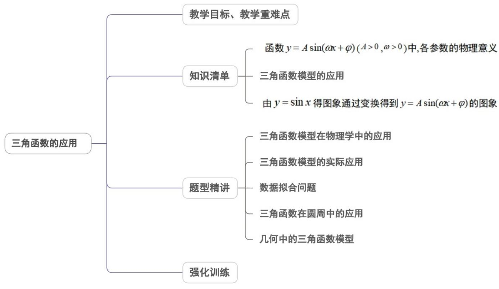
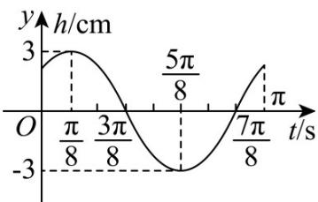
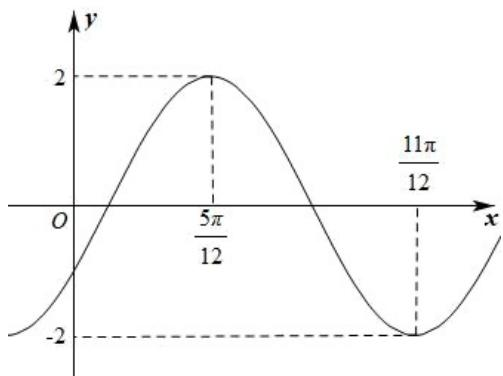
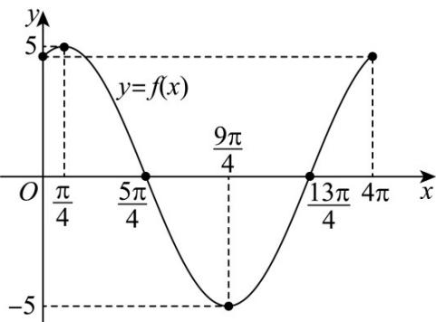
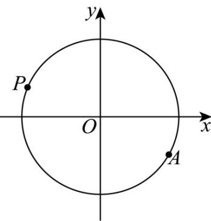

<!-- source-part:1 pages:1-50 -->

## 专题5.7 三角函数的应用

## 内容概览

## 教学目标、教学重难点

<table><tr><td>教学目标</td><td>1.掌握三角函数的图象与解析式之间的对应问题的处理方法。2.能结合实际生产与生活中与三角函数之间的密切关系,用三角函数这一数学模式解决与之相关的问题。3.能处理三角函数相关学科之间的问题,用三角函数这一重要工具解决与数学、物理学及其它学科与之相关联的问题。4.掌握数学建模的重要方法与步骤,并能严谨的应用数学知识解决问题。</td></tr><tr><td>教学重难点</td><td>1.重点:掌握常见的三角函数应用问题的处理方法。2.难点:了解并掌握数学建模的方法与步骤,能处理与三角函数相结合的数学问题、物理问</td></tr></table>

题及与之相关的其它学科与生产、生活有密切联系的问题。

## 知识清单

知识点 01 函数 $y = A \sin(\omega x + \varphi)$ (A > 0, $\omega > 0$ ) 中, 各参数的物理意义

<table><tr><td>振幅</td><td>A</td><td>它是做简谐运动的物体离开平衡位置的最大距离</td></tr><tr><td>周期</td><td> $T = \frac{2\pi}{\omega}$ </td><td>它是做简谐运动的物体往复运动一次所需要的时间</td></tr><tr><td>频率</td><td> $f = \frac{1}{T}$ </td><td>它是做简谐运动的物体在单位时间内往复运动的次数</td></tr><tr><td>相位</td><td> $\omega x + \varphi$ </td><td> $x = 0$ 时的相位 $\varphi$ 称为初相</td></tr></table>

## 【即学即练】

1. 已知挂在弹簧下方的小球上下振动，小球在时间 $t$ （单位： $^{s}$ ）时相对于平衡位置（即静止时的位置）的距

$h(t) = A\sin (\omega t + \varphi)(A > 0, \omega > 0, 0 < \varphi < \frac{\pi}{2})$ 离 $h$ （单位：cm）由函数解析式 决定，其部分图像如图所示

(1)求小球在振动过程中的振幅、最小正周期和初相；

(2)若 $t \in [0, t_0]$ 时，小球至少有101次速度为 $0\mathrm{cm / s}$ ，则 $t_0$ 的最小值是多少？

【答案】(1) $\varphi = \frac{\pi}{4}$

(2) $\frac{401\pi}{8}$

【详解】（1）由图易知小球的振幅 A = 3，

最小正周期 $T = 2\left(\frac{7\pi}{8} - \frac{3\pi}{8}\right) = \pi$ ，所以 $\omega = \frac{2\pi}{T} = 2$ ，∴ $h(t) = 3\sin(2t + \varphi)$

代入 $\left(\frac{\pi}{8},3\right)$ 可得 $3 = 3\sin \left(2\times \frac{\pi}{8} +\varphi\right)$ ， $\frac{\pi}{4} +\varphi = \frac{\pi}{2} +2k\pi ,k\in Z$ ，即 $\varphi = \frac{\pi}{4} +2k\pi ,k\in Z$

又 $0 < \varphi < \frac{\pi}{2}$ ，∴初相 $\varphi = \frac{\pi}{4}$

(2) 小球在振动过程中位于最高、最低位置时的速度为 0cm/s

∴小球有 100 次速度为 0cm/s 等价于函数 $h(t)$ 有 100 次取得最值，

$\because$ 函数 $h(t)$ 在一个周期内取得一次最大值、一次最小值， $\frac{100}{2} = 50$

∴函数 $h(t)$ 经过 50 个周期时小球有 100 次速度为 0cm/s，

$\therefore t\in[0,50\pi]$ 时，小球有 $^{100}$ 次速度为 0cm/s，

又∵当 $t=\frac{\pi}{8}$ 时，小球速度为 0cm/s，

$\therefore t_{0}$ 的最小值为 $50\pi + \frac{\pi}{8} = \frac{401\pi}{8}$

2. 如图为某简谐振动的图象，它符合 $y = A \sin (\omega x + \varphi)$ （ $A > 0, \omega > 0, -\frac{\pi}{2} < \varphi < \frac{\pi}{2}$ ）的形式。

(1)求该简谐振动的振幅、周期、频率和初相；

(2)求该简谐振动的函数解析式；

(3)求该函数的单调递增区间.

【答案】(1)振幅 A = 2 ，周期 $T = \pi$ ，频率为 $\frac{1}{\pi}$ ，初相位为 $\varphi = -\frac{\pi}{3}$

(2) $y = 2 \sin \left( 2x - \frac{\pi}{3} \right)$

(3) $\left[k\pi - \frac{\pi}{12}, k\pi + \frac{5\pi}{12}\right], k \in Z$

【详解】（1）由图象可得振幅 $A = 2$ ， $\frac{T}{2} = \frac{11\pi}{12} -\frac{5\pi}{12} = \frac{\pi}{2}$ ，故周期 $T = \pi$ ，所以频率为 $\frac{1}{\pi}$

又 $\frac{2\pi}{\omega} = \pi$ ，故 $\omega = 2$

所以 $2 \times \frac{5\pi}{12} + \varphi = \frac{\pi}{2} + 2k\pi, k \in Z$ ，而 $-\frac{\pi}{2} < \varphi < \frac{\pi}{2}$ ，故 $\varphi = -\frac{\pi}{3}$ ，

故初相位为： $\varphi=-\frac{\pi}{3}$

(2) 由 (1) 可得 $y = 2 \sin \left(2x - \frac{\pi}{3}\right)$ .

(3) 因为 $y = 2 \sin \left(2x - \frac{\pi}{3}\right)$ ，故令 $2k\pi - \frac{\pi}{2} \leq 2x - \frac{\pi}{3} \leq 2k\pi + \frac{\pi}{2}, k \in Z$

解得 $k\pi - \frac{\pi}{12} \leq x \leq k\pi + \frac{5\pi}{12}, k \in Z$

故该函数的增区间为 $\left[k\pi -\frac{\pi}{12},k\pi +\frac{5\pi}{12}\right],k\in Z$

## 知识点 02 三角函数模型的应用

1.三角函数模型的应用

三角函数作为描述现实世界中周期现象的一种数学模型，可以用来研究很多问题，在刻画周期变化规律、预

测其未来等方面都发挥着十分重要的作用．实际问题通常涉及复杂的数据，因此往往需要使用信息技术．

2.三角函数模型应用的步骤

(1) 建模问题步骤：审读题意→建立三角函数式→根据题意求出某点的三角函数值→解决实际问题.

（1）建立数学模型的关键，先根据题意设出代表函数，再利用数据求出待定系数，然后写出具体的三角函数式.

3.三角函数应用题的三种模式

（1）给定呈周期变化规律的三角函数模型，根据所给模型，结合三角函数的性质，解决一些实际问题。

（2）给定呈周期变化的图象，利用待定系数法求出函数模型，再解决其他问题.

（3）整理一个实际问题的调查数据，根据数据作出散点图，通过拟合函数图象，求出可以近似表示变化规律的函数模型，进一步用函数模型来解决问题。

【即学即练】

1. 潮汐是发生在沿海地区的一种自然现象，其形成是海水受日月的引力·潮是指海水在一定的时候发生涨落

的现象·一般来说，早潮叫潮，晚潮叫汐·某观测站通过长时间的观测，其发现潮汐的涨落规律和函数图象

$f(x) = A\sin (\omega x + \varphi)\left(\omega >0,0 <   \varphi <  \frac{\pi}{2}\right)$ 基本一致且周期为 $4\pi$ ，其中 $x$ 为时间， $f(x)$ 为水深·当 $x = \frac{\pi}{4}$ 时，海水

上涨至最高 $^{5}$ 米·

(1) 作出函数 $f(x)$ 在 $[0,4\pi]$ 内的图象，并求出潮汐涨落的频率和初相；

(2) 求海水水深持续加大的时间区间·

【答案】（1）图见解析，频率 $f = \frac{1}{4\pi}$ ，初相 $\varphi = \frac{3\pi}{8}$ ；（2） $-\frac{7\pi}{4} + 4k\pi \leq x \leq \frac{\pi}{4} + 4k\pi (k \in \mathbf{Z})$

【详解】（1） $T=\frac{2\pi}{|\omega|}=4\pi\Rightarrow\omega=\frac{1}{2}$ ，又A=5，

$x = \frac{\pi}{4}$ 时， $\sin \left(\frac{1}{2} \cdot \frac{\pi}{4} + \varphi\right) = 1 \Rightarrow \varphi = \frac{3\pi}{8}$

故函数 $f(x)=5\sin\left(\frac{1}{2}x+\frac{3\pi}{8}\right)$

频率 $f = \frac{1}{T} = \frac{1}{4\pi}$ ； $x = 0$ 时，初相 $\varphi = \frac{3\pi}{8}$

图象应用五点作图法分别取 $x = 0, \frac{\pi}{4}, \frac{5\pi}{4}, \frac{9\pi}{4}, \frac{13\pi}{4}, 4\pi$

求出对应的函数值，并描点和绘制

(2) 求海水水深持续加大的时间区间，

即求 $f(x)$ 的单调递增区间·

令 $z=\frac{1}{2}x+\frac{3\pi}{8}$

函数 $y = 5\sin z$ 的单调递增区间为 $\left[-\frac{\pi}{2} + 2k\pi, \frac{\pi}{2} + 2k\pi\right]$

即 $-\frac{\pi}{2} + 2k\pi \leq \frac{1}{2} x + \frac{3\pi}{8} \leq \frac{\pi}{2} + 2k\pi \Rightarrow -\frac{7\pi}{8} + 2k\pi \leq \frac{1}{2} x \leq \frac{\pi}{8} + 2k\pi$

即 $-\frac{7\pi}{4} + 4k\pi \leq x \leq \frac{\pi}{4} + 4k\pi (k \in \mathbf{Z})$

2. 水车在古代是进行灌溉引水的工具，是人类的一项古老的发明，也是人类利用自然和改造自然的象征·如图是一个半径为 $R$ 的水车，一个水斗从点 $A(3\sqrt{3}, -3)$ 出发，沿圆周按逆时针方向匀速旋转，且旋转一周用时60秒·经过 $t$ ·秒后，水斗旋转到 $P$ 点，设点 $P$ 的坐标为 $(x, y)$ ，其纵坐标满足 $y = f(t) = R\sin (\omega t + \varphi)$ （ $t = 0$ ， $\omega > 0$ ， $|\varphi| < \frac{\pi}{2}$ ）.

(1)求函数 $f(t)$ 的解析式；

(2) 当 $t \in [35, 55]$ 时，求点 $P$ 到 $x$ 轴的距离的最大值.

【答案】(1) $f(t)=6\sin\left(\frac{\pi}{30}t-\frac{\pi}{6}\right)$ ;

(2)6.

【详解】（1）由题意 $R = \sqrt{27 + 9} = 6$ ， $T = 60 = \frac{2\pi}{\omega}$ ，则 $\omega = \frac{\pi}{30}$

由题意 $f(0) = -3$ ，即 $-3 = 6\sin\varphi$ ，又 $\left|\varphi\right| < \frac{\pi}{2}$ ，则 $\varphi = -\frac{\pi}{6}$ 。

$$
\therefore f (t) = 6 \sin \left(\frac {\pi}{3 0} t - \frac {\pi}{6}\right)
$$

(2) 由 (1) 知 $f(t) = 6\sin \left(\frac{\pi}{30} t - \frac{\pi}{6}\right)$ ,

$$
\text {当} t \in [ 3 5, 5 5 ] _ {\text {时}}, \frac {\pi}{3 0} t - \frac {\pi}{6} \in \left[ \pi , \frac {5}{3} \pi \right],
$$

$$
\therefore \sin \left(\frac {\pi}{3 0} t - \frac {\pi}{6}\right) \in [ - 1, 0 ] \text {, 故} | f (t) | \in [ 0, 6 ],
$$

∴ 点 P 到 x 轴的距离的最大值为 6.

## 题型精讲

![[高中/课堂同步/题库/人教A版高中数学同步讲义(2026)/01_必修第一册/第五章 三角函数/专题5.7 三角函数的应用（高效培优讲义）数学人教A版2019高一必修第一册/题型01_三角函数模型在物理学中的应用/题型01_三角函数模型在物理学中的应用.md]]
![[高中/课堂同步/题库/人教A版高中数学同步讲义(2026)/01_必修第一册/第五章 三角函数/专题5.7 三角函数的应用（高效培优讲义）数学人教A版2019高一必修第一册/题型02_三角函数模型的实际应用/题型02_三角函数模型的实际应用.md]]
![[高中/课堂同步/题库/人教A版高中数学同步讲义(2026)/01_必修第一册/第五章 三角函数/专题5.7 三角函数的应用（高效培优讲义）数学人教A版2019高一必修第一册/题型03_数据拟合问题/题型03_数据拟合问题.md]]
![[高中/课堂同步/题库/人教A版高中数学同步讲义(2026)/01_必修第一册/第五章 三角函数/专题5.7 三角函数的应用（高效培优讲义）数学人教A版2019高一必修第一册/题型04_三角函数在圆周中的应用/题型04_三角函数在圆周中的应用.md]]
![[高中/课堂同步/题库/人教A版高中数学同步讲义(2026)/01_必修第一册/第五章 三角函数/专题5.7 三角函数的应用（高效培优讲义）数学人教A版2019高一必修第一册/题型05_几何中的三角函数模型/题型05_几何中的三角函数模型.md]]
![[高中/课堂同步/题库/人教A版高中数学同步讲义(2026)/01_必修第一册/第五章 三角函数/专题5.7 三角函数的应用（高效培优讲义）数学人教A版2019高一必修第一册/强化训练/强化训练.md]]
