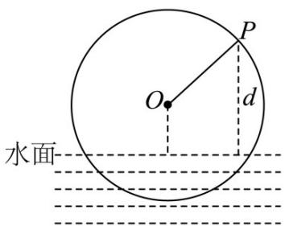

<!-- question-source:start -->
2．如图，一个半径为 $^{3}$ 米的筒车按逆时针方向每分钟转 $^{1.5}$ 圈，筒车的轴心O距离水面的高度为 $^{1.5}$ 米·设筒

车上的某个盛水筒 P 到水面的距离为 d （单位：米）（在水面下则 d 为负数），若以盛水筒 P 刚浮出水面时

开始计算时间，则 $d$ 与时间 $t$ （单位：秒）之间的关系为 $d = A\sin (\omega t + \varphi) + K$ （ $A > 0$ ， $\omega > 0$ ， $-\frac{\pi}{2} < \varphi < \frac{\pi}{2}$ ）

则（）

$$
\omega = \frac {2}{3}
$$

$$
\varphi = - \frac {\pi}{3}
$$

C. 盛水筒出水后至少经过 $\frac{50}{3}$ 秒就可到达最低点 D. 盛水筒 $P$ 在转动一圈的过程中， $P$ 在水中的时间为 $\frac{40}{3}$ 秒
<!-- question-source:end -->

![[高中/课堂同步/题库/人教A版高中数学同步讲义(2026)/01_必修第一册/第五章 三角函数/专题5.7 三角函数的应用（高效培优讲义）数学人教A版2019高一必修第一册/强化训练/questions/answers/Q00076482A1.md]]
