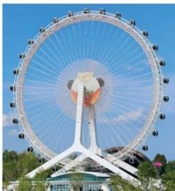
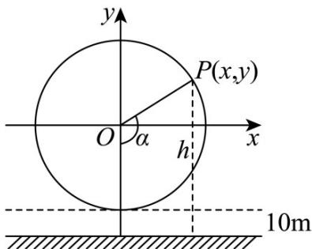

<!-- question-source:start -->
3. 已知摩天轮的半径为 $60\mathrm{m}$ ，其中心距离地面 $70\mathrm{m}$ ，摩天轮做匀速转动，每 $30\mathrm{min}$ 转一圈，摩天轮上点 $P$ 的

起始位置在最低点处．则在时刻 $t(\min)$ 时，点 $P$ 离地面的高度 $h$ 为（）

A. $60\sin \frac{1}{15}\pi t + 70$ B. $60\sin (\frac{1}{15}\pi t - \frac{1}{2}\pi) + 70$ C. $60\sin (\frac{1}{15}\pi t + \frac{1}{2}\pi) + 70$ D. $60\cos (\frac{1}{15}\pi t - \frac{1}{2}\pi) + 70$
<!-- question-source:end -->

![[高中/课堂同步/题库/人教A版高中数学同步讲义(2026)/01_必修第一册/第五章 三角函数/专题5.7 三角函数的应用（高效培优讲义）数学人教A版2019高一必修第一册/强化训练/questions/answers/Q00076483A1.md]]
