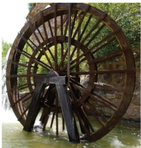
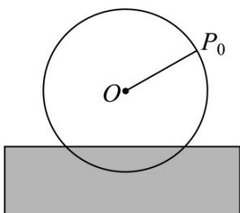

<!-- question-source:start -->
4．如图，为了打造传统农耕文化，某景区的景观筒车直径 $12$ 米，有 $24$ 个盛水筒均匀分布，分别寓意一年

$^{12}$ 个月和 $^{24}$ 节气，筒车转一周需 $^{48}$ 秒，其最高点到水面的距离为 $^{10}$ 米，每一个盛水筒都做逆时针匀速圆周

运动，盛水筒A（视为质点）的初始位置 $P$ 到水面的距离为7米．为了把水引到高处，在筒车中心 $O$ 正上方

距离水面 $^{8}$ 米处正中间设置一个宽 $^{4}$ 米的水平盛水槽，筒车受水流冲击转到盛水槽正上方后，把水倒入盛水

槽，求盛水筒A转一圈的过程中，有多长时间能把水倒入盛水槽．（参考数据： $\sin \frac{2\pi}{5}\approx \frac{2\sqrt{2}}{3}$ ）（

A. $\frac{24}{5}$ B. $\frac{26}{5}$ C. $\frac{27}{5}$ D. $\frac{28}{5}$
<!-- question-source:end -->

![[高中/课堂同步/题库/人教A版高中数学同步讲义(2026)/01_必修第一册/第五章 三角函数/专题5.7 三角函数的应用（高效培优讲义）数学人教A版2019高一必修第一册/强化训练/questions/answers/Q00076484A1.md]]
