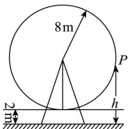

<!-- question-source:start -->
6. 如图所示，一个大风车的半径为 $8\mathrm{m}$ ，每 $12\mathrm{min}$ 旋转一周，最低点离地面 $2\mathrm{m}$ ，若风车翼片从最低点按逆时

针方向开始旋转，则该翼片的端点 $P$ 离地面的距离 $h(m)$ 与时间 $t(\mathrm{min})$ 之间的函数关系是（）

A. $h = 8\sin \frac{\pi}{6} t + 2$ B. $h = 8\cos \frac{\pi}{6} t + 10$ C. $h = -8\sin \frac{\pi}{6} t + 2$ D. $h = -8\cos \frac{\pi}{6} t + 10$
<!-- question-source:end -->

![[高中/课堂同步/题库/人教A版高中数学同步讲义(2026)/01_必修第一册/第五章 三角函数/专题5.7 三角函数的应用（高效培优讲义）数学人教A版2019高一必修第一册/强化训练/questions/answers/Q00076485A1.md]]
