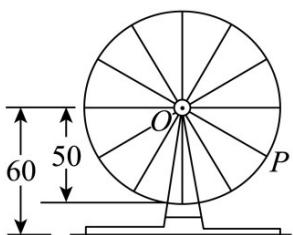

<!-- question-source:start -->
7. 如图，摩天轮上一点 $P$ 距离地面的高度 $y$ 关于时间 $t$ 的函数表达式为 $y = A\sin (\omega t + \varphi) + b$ ， $\varphi \in [-\pi, \pi]$ ，已

知摩天轮的半径为 $50\mathrm{m}$ ，其中心点 $O$ 距地面 $60\mathrm{m}$ ，摩天轮以每30分钟转一圈的方式做匀速转动，而点 $P$ 的起

始位置在摩天轮的最低点处·在摩天轮转动一圈内，点 $P$ 距离地面超过 $85\mathrm{m}$ 有多长时间（）

A.5分钟 B.10分钟 C.15分钟 D.20分钟
<!-- question-source:end -->

![[高中/课堂同步/题库/人教A版高中数学同步讲义(2026)/01_必修第一册/第五章 三角函数/专题5.7 三角函数的应用（高效培优讲义）数学人教A版2019高一必修第一册/强化训练/questions/answers/Q00076486A1.md]]
