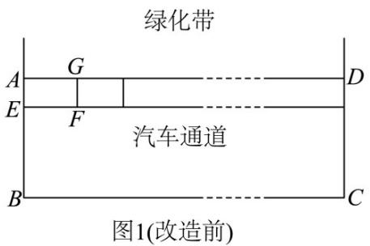
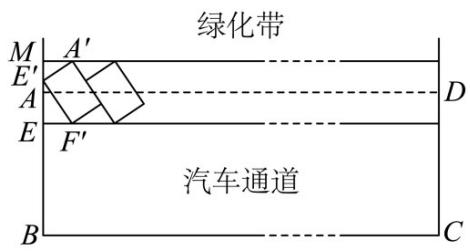

<!-- question-source:start -->
10．某小区南门有条长 $^{120}$ 米、宽 $^{6}$ 米的道路（如图 $^{1}$ 所示的矩形ABCD），路的一侧划有 $^{20}$ 个长 $^{6}$ 米、宽

2.5 米的停车位（如矩形 AEFG）·由于停车位不足，高峰期时段道路拥堵，某数学老师向小区物业提供了一个

改造方案：在不改变停车位形状大小、不改变汽车通道宽度的条件下，可通过压缩道路旁边绿化带及改变停

车位方向来增加停车位（如图 $^{2}$ 所示）·若绿化带被压缩的宽度AM为 $^{3}$ 米，停车位相对道路倾斜的角度

$\angle E^{\prime}A^{\prime}M = \theta$ ，其中 $\theta \in \left(0,\frac{\pi}{2}\right)$ 按照该老师的设计方案，该路段改造后的停车位比改造前增加的个数为（）

<!-- source-part:2 pages:51-66 -->

A.6 B.7 C.8 D.9
<!-- question-source:end -->

![[高中/课堂同步/题库/人教A版高中数学同步讲义(2026)/01_必修第一册/第五章 三角函数/专题5.7 三角函数的应用（高效培优讲义）数学人教A版2019高一必修第一册/强化训练/questions/answers/Q00076489A1.md]]
