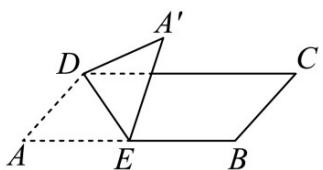

<!-- question-source:start -->
14．如图所示，在矩形ABCD中，AD=2，E为AB边上的点，现将VADE沿DE翻折至 $\triangle A^{\prime}DE$ ，使得 $A^{\prime}$ 在

平面 EBCD 上的射影在 CD 上，且直线 $A^{'}D$ 与平面 EBCD 所成的角为 $30^{\circ}$ ，则线段 AE 的长为 \_\_\_\_。

<!-- question-source:end -->

![[高中/课堂同步/题库/人教A版高中数学同步讲义(2026)/01_必修第一册/第五章 三角函数/专题5.7 三角函数的应用（高效培优讲义）数学人教A版2019高一必修第一册/强化训练/questions/answers/Q00076492A1.md]]
