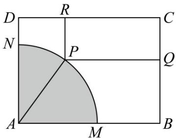

<!-- question-source:start -->
18. 如图，有一块矩形铁皮 $ABCD$ ，其中 $AB = t$ 米， $AD = 4$ 米，其中， $t$ 是一个大于等于4的常数。阴影部分

$AMN$ 是一个半径为 $3$ 米的扇形．设这个扇形已经腐蚀不能使用，但其余部分均完好．工人师傅想在未被腐蚀

的部分截下一块其边落在 $BC$ 与 $CD$ 上的矩形铁皮 $PQCR$ ，使点 $P$ 在弧 $MN$ 上．设 $\angle MAP = \theta \left(0\leq \theta \leq \frac{\pi}{2}\right)$ ，矩

形 $PQCR$ 的面积为 $S$ 平方米.

(1)求 $S$ 关于 $\theta$ 的函数表达式；

(2)当 $t = 4$ 时，求 $S$ 的最值，并求出当 $S$ 取得最值时，所对应的 $\sin \theta$ 的值.
<!-- question-source:end -->

![[高中/课堂同步/题库/人教A版高中数学同步讲义(2026)/01_必修第一册/第五章 三角函数/专题5.7 三角函数的应用（高效培优讲义）数学人教A版2019高一必修第一册/强化训练/questions/answers/Q00076495A1.md]]
