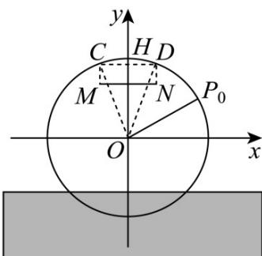
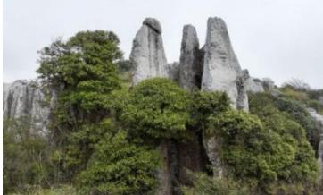
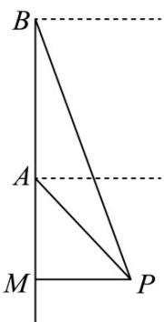

> [!faq]- 《专题5.7 三角函数的应用（高效培优讲义）数学人教A版2019高一必修第一册》官方解析
>
> > [!success]- **【答案】** A
>
> > [!note]- **【解析】**
> > 以筒车中心 $O$ 为原点，与水面平行的直线为 $x$ 轴，建立平面直角坐标系，
> >
> > 设盛水筒 A 经过 t 秒后到水面的距离为 h 米，
> >
> > 由题可知筒车半径为 $6$ ，点 $P_{0}$ 的纵坐标为 $3$ ，则 $\angle P_0Ox = \frac{\pi}{6}$
> >
> > 又由题知 $\angle AOP_{0}=\frac{2\pi}{48}t=\frac{\pi}{24}t,\quad t\in[0,48]$
> >
> > 
> >
> > 则 $h = 6 \sin \angle A O x + 4 = 6 \sin \left( \angle A O P_{0} + \angle P_{0} O x \right) + 4 = 6 \sin \left( \frac{\pi}{24} t + \frac{\pi}{6} \right) + 4, \quad t \in [0, 48]$
> >
> > 作弦 CD 平行且等于盛水槽 MN ，则在 $\triangle OCD$ 中，
> >
> > $OC = 6,OD = 6,CD = 4$ ，则 $OH = 4\sqrt{2}$ （H为 CD 中点），
> >
> > 则 $CD$ 距离水面的高度为 $4 \sqrt{2} + 4$
> >
> > 盛水筒转到盛水槽MN的正上方（即 $\overline{CD}$ 之间），能把水倒入盛水槽，
> >
> > 即当 $h = 6 \sin \left( \frac{\pi}{24} t + \frac{\pi}{6} \right) + 4 \quad 4\sqrt{2} + 4$ 时符合题意，
> >
> > 故 $\sin \left(\frac{\pi}{24} t + \frac{\pi}{6}\right) = \frac{2\sqrt{2}}{3}$ 即 $\frac{2\pi}{5} \leq \frac{\pi}{24} t + \frac{\pi}{6} \leq \frac{3\pi}{5}$ 解得 $\frac{28}{5} \leq t \leq \frac{52}{5}$
> >
> > 因为 $\frac{52}{5} -\frac{28}{5} = \frac{24}{5}$ ，所以盛水筒A转一圈的过程中，有 $\frac{24}{5}$ 秒能把水倒入盛水槽·
> >
> > 故选：A.
> >
> > 5. 钟山区小韭菜坪，位于贵州省六盘水市钟山区大湾镇，素有“贵州屋脊”之称。登上山顶放眼四周，乌蒙磅
> >
> > 礴的气势尽收眼底，景区内的野韭菜、高山洞穴、天坑等地质奇观及自然景观极具观赏价值和科考价值，是
> >
> > 贵州久负盛名的露营基地．某旅游爱好者为了测量小韭菜坪的海拔，操控无人机飞到海拔 $^{3000}$ 米的点A处，此时测得无人机观测小韭菜坪的最高点 P 的俯角为 $45^{\circ}$ ，在点 A 的高度的基础上，再操控无人机垂直提升 200 米的高度，使其到达点 B 处，此时测得无人机观测点 P 的俯角为 $71.57^{\circ}$ ，AB 与地平面垂直，则小韭菜坪的海拔为（）（参考数据：取 $\tan71.57^{\circ}=3$ ）
> >
> > 
> >
> > A.2800米 B.2900米 C.2880米 D.2920米
> >
> > 【答案】B
> >
> > 【详解】由题意作出示意图如图所示，过 $P$ 向 $AB$ 所在直线作垂线，垂足为 $M$ ，由题意， $AM = x$ ，又因为 $B$ 外的俯角为 $71.57^{\circ}$ ，所以 $\angle BPM = 71.5^{\circ}$ 又 $\tan 71.57^{\circ} = 3$ ，所以 $BM = 3MP$ ，所以 $AB = BM - AM = 2MP$ 又因为 $AB = 200$ ，所以 $2MP = 200$ ，所以 $MP = 100$ 而 $\angle APM = 45^{\circ}$ ，故 $AM = MP = 100$ 所以点 $M$ 的海拔高度为 $3000 - 100 = 2900$ ，所以小韭菜坪的海拔为 $2900$ 米·
> >
> > 
> >
> > 故选 **B**.
