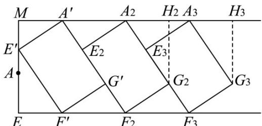
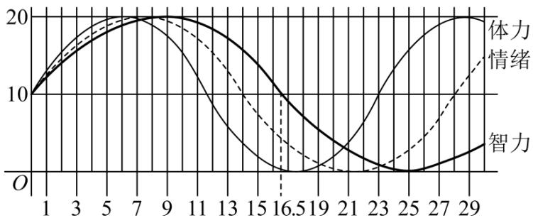

> [!faq]- 《专题5.7 三角函数的应用（高效培优讲义）数学人教A版2019高一必修第一册》官方解析
>
> > [!success]- **【答案】** B
>
> > [!note]- **【解析】**
> > 由题意得 $E^{\prime}F^{\prime}=EF=6$ ， $A^{\prime}E^{\prime}=AE=2.5$ ， $\angle A^{\prime}E^{\prime}F^{\prime}=\angle A^{\prime}ME^{\prime}=\frac{\pi}{2}$
> >
> > 故 $\angle EE'F' + \angle A'E'M = \angle MA'E' + \angle A'E'M = \frac{\pi}{2}$ ，故 $\angle EE'F' = \angle MA'E' = \theta$ ，
> >
> > $EE^{\prime} = E^{\prime}F^{\prime}\cos \theta = 6\cos \theta$ ， $E^{\prime}M = A^{\prime}E^{\prime}\sin \theta = \frac{5}{2}\sin \theta$
> >
> > $AM = EE' + E'M - AE = 6\cos\theta + \frac{5}{2}\sin\theta - \frac{5}{2}, \quad \theta \in \left(0, \frac{\pi}{2}\right)$
> >
> > 则 $6\cos\theta+\frac{5}{2}\sin\theta-\frac{5}{2}=3$
> >
> > 即 $5\sin\theta+12\cos\theta=11$ ①，
> >
> > 设 $5\cos\theta-12\sin\theta=m$ ②，
> >
> > 式子 $①^2 + ②^2$ 得 $25 + 144 = 121 + m^2$ ，解得 $m = \pm 4\sqrt{3}$
> >
> > 当 $m = 4\sqrt{3}$ 时， $\left\{ \begin{array}{l}5\sin \theta +12\cos \theta = 11\\ 5\cos \theta -12\sin \theta = 4\sqrt{3} \end{array} \right.$ ，解得 $\sin \theta = \frac{55 - 48\sqrt{3}}{169} < 0$
> >
> > 因为 $\theta\in\left(0,\frac{\pi}{2}\right)$ ， $\sin\theta>0$ ，不合要求；
> >
> > 当 $m = -4\sqrt{3}$ 时， $\left\{ \begin{array}{l}5\sin \theta +12\cos \theta = 11\\ 5\cos \theta -12\sin \theta = -4\sqrt{3} \end{array} \right.$
> >
> > 解得 $\sin\theta=\frac{55+48\sqrt{3}}{169}\approx0.817\in(0,1)$ ，满足要求，此时 $\cos\theta=\frac{132-20\sqrt{3}}{169}\approx0.576$
> >
> > 设改造后停车位数量最大值为 $n$ ，如图，过停车位顶点 $G_{n}$ 作 $MA^{\prime}$ 的垂线，垂足为 $H_{n}$
> >
> > 则顶点 $G_{n}$ 到线段 ME 距离为 $d_{n}=MA'+A'A_{2}+A_{2}A_{3}+\cdots+A_{n-1}A_{n}+A_{n}H_{n}$
> >
> > 由图及题意可得 $A^{\prime}A_{2}=A_{2}A_{3}=\cdots=A_{n-1}A_{n},\quad A_{n}H_{n}=EF^{\prime}$
> >
> > 由（1）可得 $\angle EE'F' = \angle MA'E' = \angle A'A_2E_2 = \theta$
> >
> > 故 $A^{\prime}A_{2}=A_{2}A_{3}=\cdots=A_{n-1}A_{n}=\frac{A_{2}E_{2}}{\cos\theta}=\frac{5}{2\cos\theta}\approx4.34$
> >
> > $$
> > A _ {n} H _ {n} = E F ^ {\prime} = E ^ {\prime} F ^ {\prime} \sin \theta \approx 6 \times 0. 8 1 7 = 4. 9 0 2, M A ^ {\prime} = A ^ {\prime} E ^ {\prime} \cos \theta \approx \frac {5}{2} \times 0. 5 7 6 = 1. 4 4,
> > $$
> >
> > 故 $d_{n} = MA^{\prime} + A_{2}H_{2} + (n - 1)A^{\prime}A_{2} = 1.44 + 4.902 + 4.34(n - 1) = 4.34n + 2.002$
> >
> > 由 $4.34n + 2.002 \leq 120$ ，解得 $n \leq 27.2$ ，故取 $n = 27$
> >
> > 则该路段改造后的停车位比改造前增加27-20=7个·
> >
> > 
> >
> > 故选：B
> >
> > 11. 假设某人在出生起 $^{180}$ 天内的体力、情绪、智力呈周期性变化，它们的变化规律遵循如图所示的正弦型
> >
> > 曲线模型：
> >
> > 
> >
> > 记智力曲线为 $I$ ，情绪曲线为 $E$ ，体力曲线为 $P$ ，且三条曲线的起点位于坐标系的同一点处、均为可向右延伸，则（ ）A．智力曲线 $I$ 的最小正周期是三个曲线中最大的B．在出生起 $^{180}$ 天内，体力共有 $^{7}$ 次达高峰值C．第 $^{94}$ 天时，情绪值小于 $^{15}$ D．第 $^{62}$ 天时，智力曲线 $I$ 和情绪曲线 $E$ 均处于上升期
> >
> > 【答案】AD
> >
> > 【详解】由图象，智力曲线 $I$ 的最小正周期是三个曲线中最大的，故 $\mathsf{A}$ 正确；
> >
> > 由图像，体力曲线 P 的最小正周期为 23 天， $7 \times 23 + 6 = 167 \left\langle 180, 8 \times 23 + 6 \right\rangle 180$ ，所以在出生起 180 天内，体力
> >
> > 共有 $^{8}$ 次达高峰值，故 $^{B}$ 错误；
> >
> > 由图像，情绪曲线 E 的最小正周期为 28 天，所以第 84 天情绪值为 10，第 91 天情绪值为 20，而
> >
> > 94-91=3<3.5 94，所以第天情绪值大于15，故C错误；
> >
> > 由图像，智力曲线 $I$ 的最小正周期为33天，而 $1.75 < \frac{62}{33} < 2$ ，所以第62天，智力曲线 $I$ 处于上升期，
> >
> > $2 < \frac{62}{28} < 2.25$ ，所以第62天，情绪曲线E处于上升期，故 $^{D}$ 正确·
> >
> > 故选 **AD**
