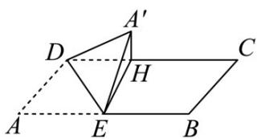

> [!faq]- 《专题5.7 三角函数的应用（高效培优讲义）数学人教A版2019高一必修第一册》官方解析
>
> > [!success]- **【答案】** 3
>
> > [!note]- **【解析】**
> > 
> >
> > 过 $A'$ 作 $A'H \perp CD$ 于 H，连接 EH，根据题意，得 $A'H \perp$ 平面 EBCD。
> >
> > 因为直线 $A^{\prime}D$ 与平面 EBCD 所成的角为 $30^{\circ}$ ，所以 $\angle A^{\prime}DH = 30^{\circ}$ .
> >
> > 又因为 $A^{\prime}D = 2$ ，所以 $A^{\prime}H = A^{\prime}D\cdot \sin 30^{\circ} = 1$ ， $DH = A^{\prime}D\cdot \cos 30^{\circ} = \sqrt{3}$ ，设 $A^{\prime}E = x$ ，则 $EH = \sqrt{x^2 - 1}$
> >
> > 在四边形 $EBCD$ 中，可得 $AD^2 + (AE - DH)^2 = EH^2$ ，所以 $2^2 + (x - \sqrt{3})^2 = x^2 - 1$ ，故 $x = \frac{4\sqrt{3}}{3}$
> >
> > 故答案为： $\frac{4\sqrt{3}}{3}$
