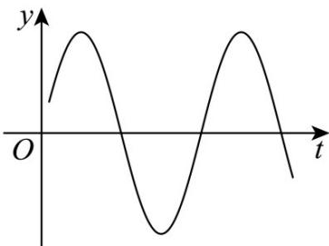

> [!faq]- 《专题5.7 三角函数的应用（高效培优讲义）数学人教A版2019高一必修第一册》官方解析
>
> > [!success]- **【答案】** $5 \sqrt{2}$
>
> > [!note]- **【解析】**
> > 因为 $f(t) = 10 - a\cos \frac{\pi}{12} t - b\sin \frac{\pi}{12} t = 10 - \sqrt{a^2 + b^2}\sin \left(\frac{\pi}{12} t + \varphi\right)$
> >
> > 且 $f(t)$ 的最小正周期为 $T = \frac{2\pi}{\frac{\pi}{12}} = 24$ ，即 $t \in [0, 24]$ 正好为一个满周期，
> >
> > 可知 $f(t)$ 的最大值为 $10 + \sqrt{a^2 + b^2}$ ，最小值为 $10 - \sqrt{a^2 + b^2}$
> >
> > 所以最大温差为 $2 \sqrt{a^{2} + b^{2}}$
> >
> > 由题意得 $2\sqrt{a^{2}+b^{2}}=10$ ，即 $a^{2}+b^{2}=25$
> >
> > 又因为 $a, b$ 为正实数，
> >
> > 则 $\frac{(a + b)^2}{2} = \frac{a^2 + b^2 + 2ab}{2} \leq \frac{2(a^2 + b^2)}{2} = 25$
> >
> > 所以 $a + b \leq 5\sqrt{2}$ ，当且仅当 $a = b = \frac{5\sqrt{2}}{2}$ 时，等号成立，
> >
> > 所以 $a + b$ 的最大值为 $5\sqrt{2}$ .
> >
> > 故答案为： $5\sqrt{2}$
> >
> > 16. 阻尼器是一种以提供阻力达到减震效果的专业工程装置。我国第一高楼上海中心大厦的阻尼器减震装置被称为“定楼神器”。由物理学知识可知，某阻尼器的运动过程可近似为单摆运动，其离开平衡位置的位移 $y$ （m）和时间 $t(s)$ 的函数关系为 $y = \sin (\omega t + \varphi)(\omega > 0, |\varphi| < \pi)$ ，如图，若该阻尼器在摆动过程中连续三次到达同一位置的时间分别为 $t_1, t_2, t_3 (0 < t_1 < t_2 < t_3)$ ，且 $t_1 + t_2 = 2, t_2 + t_3 = 5$ ，则在一个周期内阻尼器离开平衡位置的位移大于 $0.5m$ 的总时间为 \_\_\_\_ s。
> >
> > 
> >
> > 【答案】1
> >
> > 【详解】∵该阻尼器在摆动过程中连续三次到达同一位置的时间分别为 $t_{1}$ ， $t_{2}$ ， $t_{3}$ （ $0 < t_{1} < t_{2} < t_{3}$ ），且
> >
> > $$
> > t _ {1} + t _ {2} = 2 \quad t _ {2} + t _ {3} = 5
> > $$
> >
> > $$
> > \therefore T = t _ {3} - t _ {1} = 3, \mathrm{Q} T = \frac {2 \pi}{\omega}, \therefore \frac {2 \pi}{\omega} = 3, \therefore \omega = \frac {2 \pi}{3}, \therefore y = \sin \left(\frac {2 \pi}{3} t + \varphi\right),
> > $$
> >
> > 由 $y > 0.5$ 可得 $\sin \left(\frac{2\pi}{3} t + \varphi\right) > 0.5$
> >
> > $$
> > \therefore 2 k \pi + \frac {\pi}{6} <   \frac {2 \pi}{3} t + \varphi <   2 k \pi + \frac {5 \pi}{6}, k \in \mathbf {Z}, \therefore 3 k + \frac {1}{4} - \frac {3 \varphi}{2 \pi} <   t <   3 k + \frac {5}{4} - \frac {3 \varphi}{2 \pi}, k \in \mathbf {Z},
> > $$
> >
> > $$
> > \therefore \left(3 k + \frac {5}{4} - \frac {3 \varphi}{2 \pi}\right) - \left(3 k + \frac {1}{4} - \frac {3 \varphi}{2 \pi}\right) = 1
> > $$
> >
> > ∴ 在一个周期内阻尼器离开平衡位置的位移大于 $0.5 \, m$ 的总时间为 $1 \, s$ .
> >
> > 故答案为：1·
