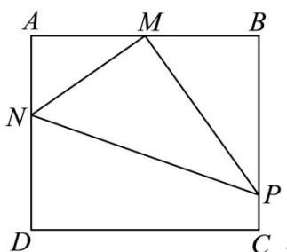

> [!faq]- 《专题5.7 三角函数的应用（高效培优讲义）数学人教A版2019高一必修第一册》官方解析
>
> > [!success]- **【答案】** (1) $S_{\max}=864\sqrt{3}\left(\mathrm{m}^{2}\right)$ ; (2) $\left[7200\left(\sqrt{2} + 1\right), 7200\left(\sqrt{3} + 1\right)\right]$ .
>
> > [!note]- **【解析】**
> > （1）设 $\angle AMN = \theta$ ，由题意
> >
> > 
> >
> > 当 $N$ 在 $D$ 点时， $\theta$ 最大，此时 $\tan \theta = \sqrt{3}$ ， $\theta = \frac{\pi}{3}$
> >
> > 当 $P$ 在 $C$ 点时， $\theta$ 最小，此时 $\tan \theta = \frac{\sqrt{3}}{3}$ ， $\theta = \frac{\pi}{6}$
> >
> > $$
> > \therefore \theta \in \left[ \frac {\pi}{6}, \frac {\pi}{3} \right]
> > $$
> >
> > $$
> > \therefore S = \frac {1}{2} M N \cdot M P = \frac {1}{2} \cdot \frac {3 6}{\cos \theta} \cdot \frac {3 6}{\sin \theta} = \frac {1 2 9 6}{\sin 2 \theta} \left(\theta \in \left[ \frac {\pi}{6}, \frac {\pi}{3} \right]\right),
> > $$
> >
> > $$
> > \because 2 \theta \in \left[ \frac {\pi}{3}, \frac {2 \pi}{3} \right], \therefore \frac {\sqrt {3}}{2} \leq \sin 2 \theta \leq 1
> > $$
> >
> > $$
> > \therefore \text {当} \sin 2 \theta = \frac {\sqrt {3}}{2}, \text {即} \theta = \frac {\pi}{6} \text {或} \theta = \frac {\pi}{3} \text {时,} S _ {\max} = 1 2 9 6 \times \frac {2}{\sqrt {3}} = 8 6 4 \sqrt {3} \left(\mathrm{m} ^ {2}\right)
> > $$
> >
> > (2) 记 $\triangle MPN$ 的周长为 L，由 (1) 知，
> >
> > $$
> > P N = \sqrt {M N ^ {2} + M P ^ {2}} = \sqrt {\left(\frac {3 6}{\cos \theta}\right) ^ {2} + \left(\frac {3 6}{\sin \theta}\right) ^ {2}} = \frac {3 6}{\sin \theta \cos \theta},
> > $$
> >
> > $$
> > \therefore L = M N + M P + P N = \frac {3 6}{\cos \theta} + \frac {3 6}{\sin \theta} + \frac {3 6}{\cos \theta \sin \theta}
> > $$
> >
> > $$
> > \therefore L = \frac {3 6 (\cos \theta + \sin \theta + 1)}{\cos \theta \sin \theta}, \quad \theta \in \left[ \frac {\pi}{6}, \frac {\pi}{3} \right].
> > $$
> >
> > 令 $m = \cos \theta + \sin \theta$ ，则 $\cos \theta \sin \theta = \frac{m^{2} - 1}{2}$
> >
> > $$
> > \therefore L = \frac {3 6 (m + 1)}{\frac {m ^ {2} - 1}{2}} = \frac {7 2}{m - 1}.
> > $$
> >
> > $$
> > \because m = \sqrt {2} \sin \left(\theta + \frac {\pi}{4}\right), \quad \theta + \frac {\pi}{4} \in \left[ \frac {5 \pi}{1 2}, \frac {7 \pi}{1 2} \right]
> > $$
> >
> > $$
> > \therefore m \in \left[ \frac {\sqrt {3} + 1}{2}, \sqrt {2} \right], m - 1 \in \left[ \frac {\sqrt {3} - 1}{2}, \sqrt {2} - 1 \right],
> > $$
> >
> > $$
> > \therefore \frac {1}{m - 1} \in \left[ \sqrt {2} + 1, \sqrt {3} + 1 \right],
> > $$
> >
> > $$
> > \therefore 7 2 (\sqrt {2} + 1) \leq L \leq 7 2 (\sqrt {3} + 1)
> > $$
> >
> > $$
> > \therefore Q \in \left[ 7 2 0 0 (\sqrt {2} + 1), 7 2 0 0 (\sqrt {3} + 1) \right].
> > $$
