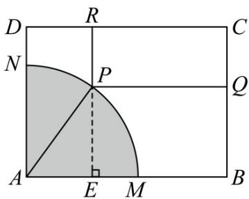
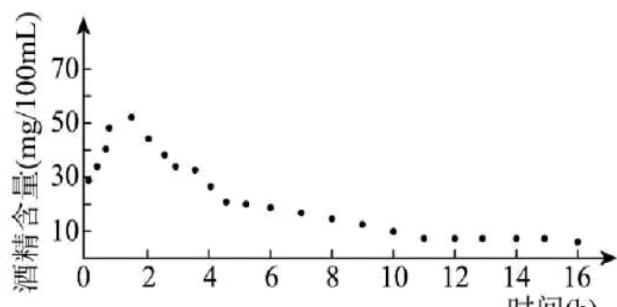

> [!faq]- 《专题5.7 三角函数的应用（高效培优讲义）数学人教A版2019高一必修第一册》官方解析
>
> > [!success]- **【答案】** (1) $S = (4 - 3\sin \theta)(t - 3\cos \theta)$ ， $\left(0 \leq \theta \leq \frac{\pi}{2}\right)$ ； (2)答案见解析.
>
> > [!note]- **【解析】**
> > （1）过 $P$ 作 $PE \perp AB$ ，垂足为 $E$ ，由题意得： $PE = 3\sin \theta$ ， $AE = 3\cos \theta$
> >
> > 故 $PQ = AB - AE = t - 3\cos \theta$ ， $PR = AD - PE = 4 - 3\sin \theta$
> >
> > 
> >
> > 所以矩形 $PQCR$ 的面积 $S = PR \cdot PQ = (4 - 3\sin \theta)(t - 3\cos \theta)$ ， $\left(0 \leq \theta \leq \frac{\pi}{2}\right)$
> >
> > (2) 由 (1) 及题设知 $S = (4 - 3\sin \theta)(4 - 3\cos \theta)$ ,
> >
> > 故 $S = (4 - 3\sin \theta)(4 - 3\cos \theta) = 16 - 12(\sin \theta +\cos \theta) + 9\sin \theta \cos \theta$
> >
> > 令 $\sin \theta +\cos \theta = m = \sqrt{2}\sin \left(\theta +\frac{\pi}{4}\right)$ ， $0\leq \theta \leq \frac{\pi}{2}$ 所以 $m\in [1,\sqrt{2} ]$ ，且 $\sin \theta \cos \theta = \frac{m^2 - 1}{2}$
> >
> > $$
> > S = 1 6 - 1 2 m + \frac {9}{2} \left(m ^ {2} - 1\right) = \frac {9}{2} \left(m - \frac {4}{3}\right) ^ {2} + \frac {7}{2},
> > $$
> >
> > $h(m) = \frac{9}{2}\left(m - \frac{4}{3}\right)^2 +\frac{7}{2}$ 在区间 $\left[1,\frac{4}{3}\right]$ 上严格减，在区间 $\left[\frac{4}{3},\sqrt{2}\right]$ 上严格增，且 $h(1) = 4 > h(\sqrt{2}) = \frac{41}{2} -12\sqrt{2}$
> >
> > 当 $m = \frac{4}{3}$ ，即 $\sin \theta +\cos \theta = \frac{4}{3}$ 时，S取得最小值 $\frac{7}{2}$
> >
> > 此时 $\sin\theta+\sqrt{1-\sin^{2}\theta}=\frac{4}{3}$ ，则 $1-\sin^{2}\theta=\left(\frac{4}{3}-\sin\theta\right)^{2}$ ，故 $\sin\theta=\frac{4\pm\sqrt{2}}{6}$ ，
> >
> > 当 m=1 ，即 $\sin\theta+\cos\theta=1$ 时，S 取得最大值 4 ，
> >
> > 此时 $\sin \theta +\sqrt{1 - \sin^2\theta} = 1$ ，则 $1 - \sin^2\theta = (1 - \sin \theta)^2$ ，故 $\sin \theta = 1$ 或 $\sin \theta = 0$
> >
> > 19. 电影《流浪地球》中反复出现这样的人工语音：“道路千万条，安全第一条；行车不规范，亲人两行泪”，
> >
> > 讲的是“开车不喝酒，喝酒不开车”.2019年公安部交通管理局下发《关于治理酒驾醉驾违法犯罪行为的指导意
> >
> > 见》，对综合治理酒驾醉驾违法犯罪行为提出了新规定，其中车辆驾驶人员饮酒后或者醉酒后驾车血液中的
> >
> > 酒精含量阈值如表所示·
> >
> > 
> > 时间(h)
> >
> > <table><tr><td>驾驶行为类别</td><td>阈值(mg/100mL)</td></tr><tr><td>饮酒驾车</td><td>[20,80)</td></tr><tr><td>醉酒驾车</td><td>[80,+∞)</td></tr></table>
> >
> > 经反复试验，一般情况下某人喝一瓶啤酒后酒精含量在人体血液中的变化规律“散点图”如图所示，且图中所
> >
> > 示的酒精含量 $f(x)$ （单位：mg/100mL）随时间x（单位：h）变化的函数模型可表示为
> >
> > $f(x) = \left\{ \begin{array}{ll}40\sin \left(\frac{\pi}{3} x\right) + 13, & 0 \leq x < 2\\ 90\cdot e^{-0.5x} + 14, & x = 2 \end{array} \right.$ ，根据上述条件：
> >
> > (1)试计算某人喝 $^{1}$ 瓶啤酒后多少小时血液中的酒精含量达到最大值？最大值是多少？
> >
> > (2)试计算某人喝 $^{1}$ 瓶啤酒后多少小时才可以驾车？（时间x以整小时计；参考数据： $\ln 15 \approx 2.71$ ， $\ln 30 \approx 3.40$
> >
> > 【答案】(1)1.5 小时，最大值是 $^{53}$ 毫克/百毫升·
> >
> > (2)6 小时
> >
> > 【详解】（1）当 $0 \leq x < 2$ 时， $0 \leq \frac{\pi}{3} x < \frac{2\pi}{3}$ ，故当 $\frac{\pi}{3} x = \frac{\pi}{2}$ 时，即 $x = \frac{3}{2}$ 时， $f(x)_{\max} = 40 \times 1 + 13 = 53$ ；
> >
> > 当 x 2 时， $f(x)=90\cdot e^{-0.5x}+14$ 在 $[2,+\infty)$ 上单调递减，
> >
> > $$
> > f (x) _ {\max} = f (2) = \frac {9 0}{\mathrm{e}} + 1 4 <   5 3
> > $$
> >
> > 综上， $f(x)_{\max}=f\left(\frac{3}{2}\right)=53$
> >
> > 所以，喝 $^{1}$ 瓶啤酒后 $^{1.5}$ 小时血液中的酒精含量达到最大值，最大值是 $^{53}$ 毫克/百毫升·
> >
> > (2) 当 $f(x) < 20$ 时可以驾车，且 $x \in N^{*}$
> >
> > 因 $f(1) = 40\sin \frac{\pi}{3} + 13 = 20\sqrt{3} + 13 > 20$ ，故 $x = 2$ ，
> >
> > 令 $90 \cdot e^{-0.5x} + 14 < 20$ ，得 $e^{-0.5x} < \frac{1}{15}$ ，即 $-0.5x < \ln \left(\frac{1}{15}\right)$ ，得 $x > 2\ln 15 \approx 5.42$
> >
> > 因 $x \in \mathbf{N}^*$ ，则 $x$ 的最小值为 6，
> >
> > 故喝 $^{1}$ 瓶啤酒后 $^{6}$ 小时才可以驾车·
