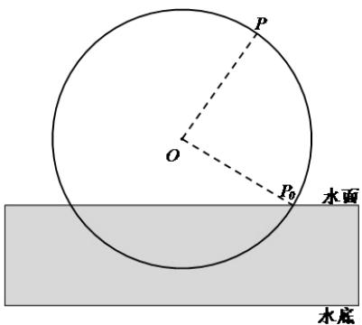

> [!faq]- 《专题5.7 三角函数的应用（高效培优讲义）数学人教A版2019高一必修第一册》官方解析
>
> > [!success]- **【答案】** $^{3}$ 米．筒车其边缘上一点P从图示位置 $P_{0}$ 开始随筒车逆时针匀速旋转（同时开始计时），设匀速旋转一周的 时间为 $t_0$ 秒，从计时起旋转时间为 $t$ 秒；点 $P$ 与水底的距离为 $h$ 米。  (1) 当 $t_0 = 120$ 时： ①直接写出 $h$ 关于 $t$ 的函数表达式； ②求前 $120$ 秒内，点 $P$ 与水底的距离为 $7$ 米时 $t$ 的值； (2)若当 $120 \leq t \leq 150$ 时，点 $P$ 一直处于水中（含水面上），求 $t_0$ 的取值范围.
>
> > [!note]- **【解析】**
> > （1）①由题意得 $h=4\sin\left(\frac{\pi t}{60}-\frac{\pi}{6}\right)+5,\quad t\in[0,+\infty)$
> > - **②**：由题意 h = 7 ， $0 \leq t \leq 120$
> >
> > 即 $4\sin \left(\frac{\pi t}{60} -\frac{\pi}{6}\right) + 5 = 7$ ，化简得 $\sin \left(\frac{\pi t}{60} -\frac{\pi}{6}\right) = \frac{1}{2}$
> >
> > 则 $\frac{\pi t}{60} -\frac{\pi}{6} = \frac{\pi}{6} +2k\pi$ 或 $\frac{\pi t}{60} -\frac{\pi}{6} = \frac{5\pi}{6} +2k\pi$
> >
> > 解得 $t = 20 + 120k$ 或 $t = 60 + 120k(k \in \mathbb{Z})$
> >
> > 又由于 $0 \leq t \leq 120$ ，所以 $t = 20$ 或 $t = 60$ .
> >
> > (2) 由 (1) 得， $h = 4 \sin \left( \frac{2\pi t}{t_{0}} - \frac{\pi}{6} \right) + 5$
> >
> > 由题意得，当 $120 \leq t \leq 150$ 时， $h \notin 3$ 恒成立，
> >
> > 即 $4\sin \left(\frac{2\pi t}{t_0} -\frac{\pi}{6}\right) + 5\leq 3$ ，化简得 $\sin \left(\frac{2\pi t}{t_0} -\frac{\pi}{6}\right)\leq -\frac{1}{2}$
> >
> > 故 $-\frac{5\pi}{6} + 2k\pi \leq \frac{2\pi t}{t_0} - \frac{\pi}{6} \leq -\frac{\pi}{6} + 2k\pi$ ，解得 $-\frac{t_0}{3} + kt_0 \leq t \leq kt_0$
> >
> > 所以 $[120,150] \subseteq \left[-\frac{t_0}{3} + kt_0, kt_0\right]$ ，即 $\begin{cases} -\frac{t_0}{3} + kt_0 \leq 120 \\ kt_0 = 150 \end{cases}$ ，解得 $\frac{150}{k} \leq t_0 \leq \frac{360}{3k - 1}$
> >
> > 由于 $t_0 > 0$ ，则 $k = 1$ ，因此 $t_0 \in [150, 180]$ .
