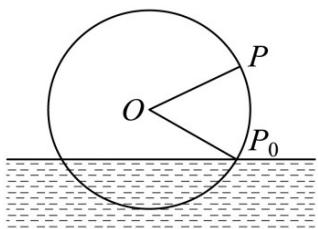

## 强化训练

1. 筒车是我国古代发明的一种水利灌溉工具，因其经济又环保，至今仍在农业生产中发挥作用，明朝科学家

徐光启在《农政全书》中用图画描绘了筒车的工作原理．一半径为 $2m$ 的筒车水轮如图，水轮圆心 $O$ 距离水

面 $1\mathrm{m}$ ，已知水轮每 $30\mathrm{s}$ 逆时针匀速转动一圈，如果当水轮上的点 $P$ 从水中浮现时（图中点 $P_0$ ）开始计时，则

下列结论错误的是（ ）

A. 点 $P$ 再次进入水中用时 $20\mathrm{s}$ B. 当水轮转动 $25\mathrm{s}$ 时，点 $P$ 处于最低点
C. 当水轮转动 $28.75\mathrm{s}$ 时，点 $P$ 距离水面 $\left(\sqrt{2} -1\right)\mathrm{m}$ D. 点 $P$ 第三次到达距水面 $\left(1 + \sqrt{3}\right)\mathrm{m}$ 时用时 $42.5\mathrm{s}$

【答案】D

【详解】由题意，角速度 $\omega=\frac{2\pi}{30}=\frac{\pi}{15}$ 弧度/秒，

又由水轮的半径为 $^{2}$ 米，且圆心 O 距离水面 $^{1}$ 米，可知半径 $OP_{0}$ 与水面所成角为 $\frac{\pi}{6}$ ，点 P 再次进入水中用时

为 $\frac{\pi + 2 \times \frac{\pi}{6}}{\frac{\pi}{15}} = 20$ 秒，故 $A$ 正确；

当水轮转动 $^{25}$ 秒时，半径 $OP_{0}$ 转动了 $25\times\frac{\pi}{15}=\frac{5\pi}{3}$ 弧度，而 $\frac{5\pi}{3}-\frac{\pi}{6}=\frac{3\pi}{2}$ ，点P正好处于最低点，故 $^{B}$ 正确；

当水轮转动 $^{28.75}$ 秒时，由于 $28.75 = 25 + 3.75$ ，又 $\omega \times 3.75 = \frac{\pi}{4}$ ，所以距水面高度为 $2\sin \frac{\pi}{4} - 1 = \sqrt{2} - 1$ 米，故C

正确；

逆时针转动一周时，两次到达离水面高度为 $\left(1 + \sqrt{3}\right)\mathrm{m}$ 用时 $^{30}$ 秒，

所以第三次到达距水面高度为 $\left(1 + \sqrt{3}\right)\mathrm{m}$ 时需要转动一周后再逆时针转动 $\frac{\pi}{3} +\frac{1}{2}\pi +\frac{\pi}{3} = \frac{7\pi}{6}$ 弧度，此时用时为 $\frac{\frac{7\pi}{6}}{\frac{\pi}{15}} = 17.5$ 秒，

所以点 P 第三次到达距水面 $\left(1+\sqrt{3}\right)$ 米时用时 47.5 秒，故 D 错误。

故选：D.

![[高中/课堂同步/题库/人教A版高中数学同步讲义(2026)/01_必修第一册/第五章 三角函数/专题5.7 三角函数的应用（高效培优讲义）数学人教A版2019高一必修第一册/强化训练/questions/Q00076482.md]]
![[高中/课堂同步/题库/人教A版高中数学同步讲义(2026)/01_必修第一册/第五章 三角函数/专题5.7 三角函数的应用（高效培优讲义）数学人教A版2019高一必修第一册/强化训练/questions/Q00076483.md]]
![[高中/课堂同步/题库/人教A版高中数学同步讲义(2026)/01_必修第一册/第五章 三角函数/专题5.7 三角函数的应用（高效培优讲义）数学人教A版2019高一必修第一册/强化训练/questions/Q00076484.md]]
![[高中/课堂同步/题库/人教A版高中数学同步讲义(2026)/01_必修第一册/第五章 三角函数/专题5.7 三角函数的应用（高效培优讲义）数学人教A版2019高一必修第一册/强化训练/questions/Q00076485.md]]
![[高中/课堂同步/题库/人教A版高中数学同步讲义(2026)/01_必修第一册/第五章 三角函数/专题5.7 三角函数的应用（高效培优讲义）数学人教A版2019高一必修第一册/强化训练/questions/Q00076486.md]]
![[高中/课堂同步/题库/人教A版高中数学同步讲义(2026)/01_必修第一册/第五章 三角函数/专题5.7 三角函数的应用（高效培优讲义）数学人教A版2019高一必修第一册/强化训练/questions/Q00076487.md]]
![[高中/课堂同步/题库/人教A版高中数学同步讲义(2026)/01_必修第一册/第五章 三角函数/专题5.7 三角函数的应用（高效培优讲义）数学人教A版2019高一必修第一册/强化训练/questions/Q00076488.md]]
![[高中/课堂同步/题库/人教A版高中数学同步讲义(2026)/01_必修第一册/第五章 三角函数/专题5.7 三角函数的应用（高效培优讲义）数学人教A版2019高一必修第一册/强化训练/questions/Q00076489.md]]
![[高中/课堂同步/题库/人教A版高中数学同步讲义(2026)/01_必修第一册/第五章 三角函数/专题5.7 三角函数的应用（高效培优讲义）数学人教A版2019高一必修第一册/强化训练/questions/Q00076490.md]]
![[高中/课堂同步/题库/人教A版高中数学同步讲义(2026)/01_必修第一册/第五章 三角函数/专题5.7 三角函数的应用（高效培优讲义）数学人教A版2019高一必修第一册/强化训练/questions/Q00076491.md]]
![[高中/课堂同步/题库/人教A版高中数学同步讲义(2026)/01_必修第一册/第五章 三角函数/专题5.7 三角函数的应用（高效培优讲义）数学人教A版2019高一必修第一册/强化训练/questions/Q00076492.md]]
![[高中/课堂同步/题库/人教A版高中数学同步讲义(2026)/01_必修第一册/第五章 三角函数/专题5.7 三角函数的应用（高效培优讲义）数学人教A版2019高一必修第一册/强化训练/questions/Q00076493.md]]
![[高中/课堂同步/题库/人教A版高中数学同步讲义(2026)/01_必修第一册/第五章 三角函数/专题5.7 三角函数的应用（高效培优讲义）数学人教A版2019高一必修第一册/强化训练/questions/Q00076494.md]]
![[高中/课堂同步/题库/人教A版高中数学同步讲义(2026)/01_必修第一册/第五章 三角函数/专题5.7 三角函数的应用（高效培优讲义）数学人教A版2019高一必修第一册/强化训练/questions/Q00076495.md]]
![[高中/课堂同步/题库/人教A版高中数学同步讲义(2026)/01_必修第一册/第五章 三角函数/专题5.7 三角函数的应用（高效培优讲义）数学人教A版2019高一必修第一册/强化训练/questions/Q00076496.md]]
