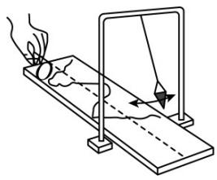
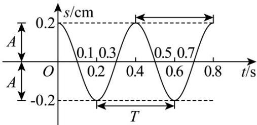

<!-- question-source:start -->
【典例1】将漏斗挂在架子上，就做成了一个简易单摆。在漏斗下方放纸板，纸板的中间画一条直线作为坐

标系的横轴，把漏斗灌上细沙并拉离平衡位置，放手使它摆动，同时匀速拉动纸板，这样就可在纸板上得到

一条曲线，它就是简谐运动的图象．它表示了漏斗对平衡位置的位移 $s$ （纵坐标）随时间 $t$ （横坐标）变化的

情况．如图①，已知一根长为 $l\mathrm{cm}$ 的线一端固定，另一端悬一个漏斗，漏斗摆动时离开平衡位置的位移 $s$ （单

位：cm）与时间 $t$ （单位：s）的函数关系是 $s = 0.2\cos \sqrt{\frac{g}{l}} t$ （图②），其中 $g\approx 980\mathrm{cm / s^2}$ ， $\pi \approx 3$ ，则估计线的

长度应当是（精确到 $0.1\mathrm{cm}$ ）（

图①

图②

A. $2.8\mathrm{cm}$ B. $3.2\mathrm{cm}$ C. $4.4\mathrm{cm}$ D. $4.9\mathrm{cm}$
<!-- question-source:end -->

![[高中/课堂同步/题库/人教A版高中数学同步讲义(2026)/01_必修第一册/第五章 三角函数/专题5.7 三角函数的应用（高效培优讲义）数学人教A版2019高一必修第一册/题型01_三角函数模型在物理学中的应用/questions/answers/Q00076462A1.md]]
