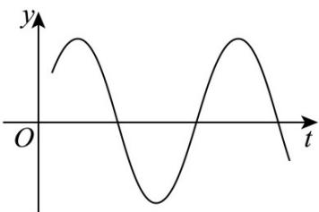

<!-- question-source:start -->
【变式1】阻尼器是一种以提供阻力达到减震效果的专业工程装置．由物理学知识可知，某阻尼器的运动过

程可近似为单摆运动，其离开平衡位置的位移 $y(\mathrm{m})$ 和时间 $t(\mathrm{s})$ 的函数关系为 $y = \sin (\omega t + \varphi)(\omega > 0, |\varphi| < \pi)$ ，

如图．若该阻尼器在摆动过程中连续三次到达同一位置的时间分别为 $t_1, t_2, t_3 (0 < t_1 < t_2 < t_3)$ ，且

$t_1 + t_2 = 2, t_2 + t_3 = 6$ ，则在一个周期内阻尼器离开平衡位置的位移小于 $0.5\mathrm{m}$ 的总时间为（）

A. $3\mathrm{s}$ B. $\frac{8}{3}\mathrm{s}$ C. $2\mathrm{s}$ D. $\frac{4}{3}\mathrm{s}$
<!-- question-source:end -->

![[高中/课堂同步/题库/人教A版高中数学同步讲义(2026)/01_必修第一册/第五章 三角函数/专题5.7 三角函数的应用（高效培优讲义）数学人教A版2019高一必修第一册/题型01_三角函数模型在物理学中的应用/questions/answers/Q00076463A1.md]]
