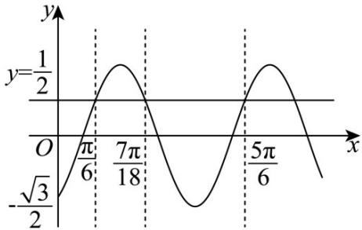

<!-- question-source:start -->
【变式2】某质点的位移 $y(\mathrm{cm})$ 与运动时间 $x(\mathrm{s})$ 的关系式为 $y = \sin (\omega x + \varphi)(\omega > 0, \varphi \in (-\pi, \pi))$ ，其图象如图

所示，图象与 $y$ 轴交点坐标为 $\left(0, -\frac{\sqrt{3}}{2}\right)$ ，与直线 $y = \frac{1}{2}$ 的相邻三个交点的横坐标依次为 $\frac{\pi}{6}$ ， $\frac{7\pi}{18}$ ， $\frac{5\pi}{6}$ ，则下

列说法正确的是（）

A. $\omega = 4$

B $\varphi = -\frac{2\pi}{3}$

C. 质点在 $\left[1, \frac{3}{2}\right] \mathrm{s}$ 内的位移图象为单调递减

D．质点在 $\left[0,\frac{7\pi}{18}\right]$ s 内走过的路程为 $(3-\sqrt{3})\mathrm{cm}$
<!-- question-source:end -->

![[高中/课堂同步/题库/人教A版高中数学同步讲义(2026)/01_必修第一册/第五章 三角函数/专题5.7 三角函数的应用（高效培优讲义）数学人教A版2019高一必修第一册/题型01_三角函数模型在物理学中的应用/questions/answers/Q00076464A1.md]]
