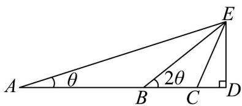

<!-- question-source:start -->
【典例1】如图，在某个位置 $A$ 处测得一旗杆 $ED$ 的仰角为 $\theta$ ，对着旗杆在平行地面上前进 $^{60}$ 米到达点 $B$ ，测

得旗杆 $ED$ 的仰角为原来的 $^2$ 倍·继续在平行地面上前进 $a$ 米到达点 $C$ ，测得旗杆 $ED$ 的仰角为原来的 $^4$ 倍，其

中 A, B, C, D 四点共线·若旗杆 ED 的高度为 30 米，则 $a = (\quad)$

A. $30\sqrt{3}$ B. $20\sqrt{3}$ C. $15\sqrt{3}$ D. $15\sqrt{2}$
<!-- question-source:end -->

![[高中/课堂同步/题库/人教A版高中数学同步讲义(2026)/01_必修第一册/第五章 三角函数/专题5.7 三角函数的应用（高效培优讲义）数学人教A版2019高一必修第一册/题型02_三角函数模型的实际应用/questions/answers/Q00076466A1.md]]
