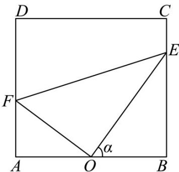

<!-- question-source:start -->
【变式3】大连某养殖公司有一处矩形养殖池ABCD，如图所示， $AB = 50$ 米， $BC = 25\sqrt{3}$ 米，为了便于冬天

给养殖池内的水加温，该公司计划在养殖池内铺设三条加温带 $OE, EF$ 和 $OF$ ，考虑到整体规划，要求 $O$ 是边

$AB$ 的中点，点 $E$ 在边 $BC$ 上，点 $F$ 在边 $AD$ 上，且 $\angle EOF = 90^{\circ}$ ，设 $\angle BOE = \alpha$

(1)试将 $\Delta OEF$ 的周长 $l$ 表示成 $\alpha$ 的函数关系式，并求出此函数的定义域；

(2) 当 $\tan\alpha=\frac{1}{2}$ 时，求加温带 EF 的长；

(3)为增加夜间水下照明亮度，决定在两条加温带 $OE$ 和 $OF$ 上按装智能照明装置，经核算，两条加温带每米

增加智能照明装置的费用均为 $400$ 元，试问如何设计才能使新加装的智能照明装置的费用最低？并求出最低

费用.
<!-- question-source:end -->

![[高中/课堂同步/题库/人教A版高中数学同步讲义(2026)/01_必修第一册/第五章 三角函数/专题5.7 三角函数的应用（高效培优讲义）数学人教A版2019高一必修第一册/题型02_三角函数模型的实际应用/questions/answers/Q00076469A1.md]]
