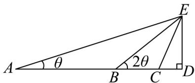
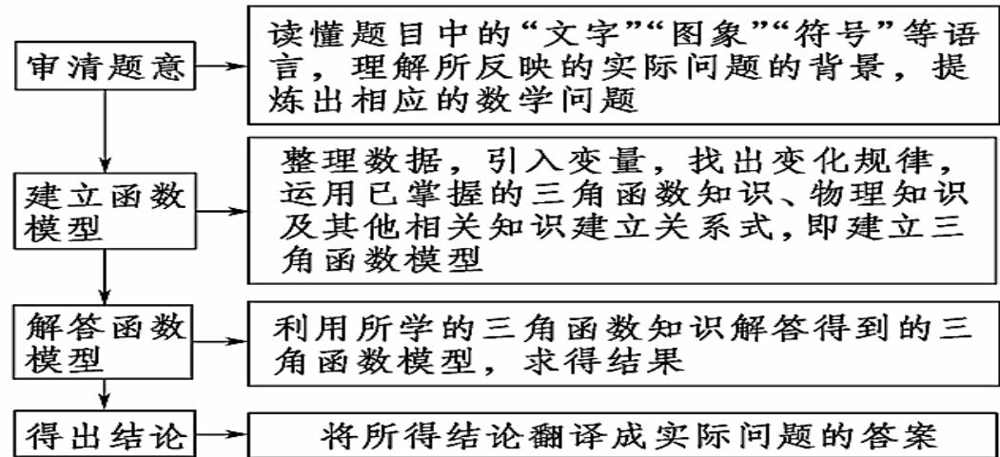

> [!faq]- 《专题5.7 三角函数的应用（高效培优讲义）数学人教A版2019高一必修第一册》官方解析
>
> > [!success]- **【答案】** B
>
> > [!note]- **【解析】**
> > 如图，在直角三角形 $EBD$ 中， $ED = 30$ ， $AB = BE = 60$ ，所以 $2\theta = 30^{\circ}$
> >
> > 在三角形 EBC 中，由余弦定理得， $\cos120^{\circ}=\frac{2a^{2}-60^{2}}{2a^{2}}=-\frac{1}{2}$ ，解得 $a=20\sqrt{3}$
> >
> > 
> >
> > 故选：B.
> >
> > ## 方法技巧
> >
> > 
