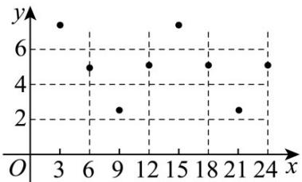

> [!faq]- 《专题5.7 三角函数的应用（高效培优讲义）数学人教A版2019高一必修第一册》官方解析
>
> > [!success]- **【答案】** (1) $f(x)=2.5\sin\left(\frac{\pi}{6}x\right)+5$ (2)该船可以 $^{1}$ 点进港， $^{5}$ 点离港，或 $^{13}$ 点进港， $^{17}$ 点离港，所以卸货最多只能用 $^{4}$ 小时时间·
>
> > [!note]- **【解析】**
> > （ $^{1}$ ）根据表中数据可画出如图所示的散点图，
> >
> > 
> >
> > 由已知数据结合图象可得 $A = 2.5$ ， $B = 5$ ， $T = 12$ ， $\omega = \frac{2\pi}{T} = \frac{\pi}{6}$
> >
> > 故 $f(x)=2.5\sin\left(\frac{\pi}{6}x+\varphi\right)+5$
> >
> > 又 $f(0) = 2.5\sin \varphi + 5 = 5$ ，可取 $\varphi = 0$
> >
> > 所以 $f(x) = 2.5\sin \left(\frac{\pi}{6} x\right) + 5$
> >
> > (2) 由题意可得 $y = 2.5 \sin \left( \frac{\pi}{6} x \right) + 5 \quad 6.25$ ，化简得 $\sin \left( \frac{\pi}{6} x \right) \quad \frac{1}{2}$
> >
> > 所以 $\frac{\pi}{6} + 2k\pi \leq \frac{\pi}{6}x \leq \frac{5\pi}{6} + 2k\pi, k \in \mathbb{Z}$ ，解得 $1 + 12k \leq x \leq 5 + 12k$ ， $k \in \mathbb{Z}$ ，
> >
> > 又 $0 \leq x \leq 24$ ，取 $k = 0$ 可得： $1 \leq x \leq 5$ ，取 $k = 1$ ，可得 $13 \leq x \leq 17$
> >
> > 所以该船可以 $^{1}$ 点进港， $^{5}$ 点离港，或 $^{13}$ 点进港， $^{17}$ 点离港，
> >
> > 所以卸货最多只能用 $^{4}$ 小时时间·
> >
> > ## 方法技巧
> >
> > （1）处理的关键：数据拟合是一项重要的数据处理能力，解决该类问题的关键在于如何把实际问题三角函数模型化，而散点图在这里起了关键作用。
> >
> > (2) 一般方法：数据对 $\rightarrow$ 作散点图 $\rightarrow$ 确定拟合函数 $\rightarrow$ 解决实际问题。
