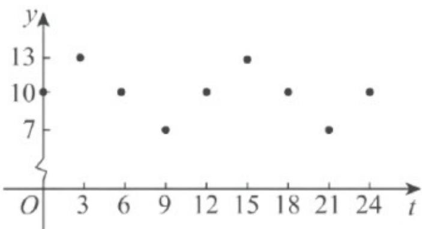

> [!faq]- 《专题5.7 三角函数的应用（高效培优讲义）数学人教A版2019高一必修第一册》官方解析
>
> > [!success]- **【答案】** (1) $y=3\sin\frac{\pi}{6}t+10$ (2)①16个小时；② $^{23}$ 时
>
> > [!note]- **【解析】**
> > （1）以时间为横坐标，水深为纵坐标，在平面直角坐标系中画出散点图，如图：
> >
> > 
> >
> > 根据图象，可考虑用函数 $y = A\sin (\omega x + \varphi) + h$ 刻画水深与时间之间的对应关系，
> >
> > 由数据和散点图可以得出 $A=\frac{13-7}{2}=3, h=\frac{13+7}{2}=10, T=12, \varphi=0$
> >
> > 由 $T = \frac{2\pi}{\omega} = 12$ ，得 $\omega = \frac{\pi}{6}$ ，所以这个港口水深 $y$ 与时间 $t$ 的关系可用 $y = 3\sin \frac{\pi}{6} t + 10$ 近似描述.
> >
> > (2) ①依题意， $y = 6.5 + 5 = 11.5$ 时就可以进出港，由 $3\sin\frac{\pi}{6}t + 10 = 11.5$ ，得 $\sin\frac{\pi}{6}t = \frac{1}{2}$
> >
> > 则 $\frac{\pi}{6} + 2k\pi \leq \frac{\pi}{6} t \leq \frac{5\pi}{6} + 2k\pi, k \in \mathbf{Z}$ ，解得 $1 + 12k \leq t \leq 5 + 12k, k \in \mathbf{Z}$ ，
> >
> > 又 $0 \leq t \leq 24$ ，因此 $1 \leq t \leq 5$ 或 $13 \leq t \leq 17$ ，而该船 $1:00$ 进港，则可以 $17:00$ 离港，
> >
> > 又在 1:00 到 17:00 这段时间内，水深最浅时为 9:00，且该时刻水深为 7 米，大于 6.5 米，
> >
> > 所以在同一天安全出港，在港内停留的最长时间是 $^{16}$ 个小时。
> > - **②**：依题意，吃水深度 $h = 6.5 - 0.5(t - 17)$ ，则要求为 $y - h = 5, t = 21$
> >
> > 当 $t \in [21, 27]$ ， $\frac{\pi t}{6} \in [\frac{7\pi}{2}, \frac{9\pi}{2}]$ 时， $y - h = 3\sin \frac{\pi t}{6} + 0.5t - 5$ 单调递增，
> >
> > 又当 t=23 时，y-h=5，则由 y-h 5,t 21，解得 t 23，
> >
> > 所以该船应在 $^{23}$ 时停止卸货，离开港口·
