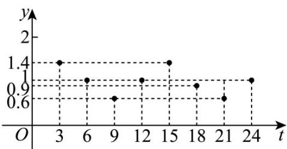

> [!faq]- 《专题5.7 三角函数的应用（高效培优讲义）数学人教A版2019高一必修第一册》官方解析
>
> > [!success]- **【答案】** (1)选择 $y = A \sin(\omega t + \varphi) + b$ 较合适， $y = \frac{2}{5} \sin \frac{\pi}{6} t + 1 (0 \leq t \leq 24)$ ; (2)应安排在 $^{11}$ 时到 $^{19}$ 时训练较恰当
>
> > [!note]- **【解析】**
> > （1）把表格中的数据在坐标系内描出，如下，
> >
> > 
> >
> > 由所描点知：应选择 $y = A\sin (\omega x + \varphi) + b$
> >
> > 令 A > 0 ， $\omega > 0$ ， $|\varphi| < \pi$
> >
> > 依题意，函数的最大值为 1.4，最小值为 0.6，周期为 T = 12，
> >
> > 则 $A = \frac{1.4 - 0.6}{2} = \frac{2}{5}$ ， $b = \frac{1.4 + 0.6}{2} = 1$ ， $\omega = \frac{2\pi}{12} = \frac{\pi}{6}$
> >
> > 于是 $y = \frac{2}{5}\sin (\frac{\pi}{6} x + \varphi) + 1$ ，代入点(3,1.4)，得 $\frac{2}{5}\sin (\frac{\pi}{2} +\varphi) + 1 = 0.4\cos \varphi +1 = 1.4$
> >
> > 即 $\cos\varphi=1$ ，则 $\varphi=2k\pi, k\in Z$ ，又 $|\varphi|<\pi$ ，因此 $\varphi=0$ ，
> >
> > 所以该模型的解析式为： $y=\frac{2}{5}\sin(\frac{\pi}{6}t)+1(0\leq t\leq24)$
> >
> > (2) 令 $y=\frac{2}{5}\sin\frac{\pi}{6}t+1$ 0.8，得 $\sin\frac{\pi}{6}t - \frac{1}{2}$ ，则 $-\frac{\pi}{6}+2k\pi\leq\frac{\pi}{6}t\leq\frac{7\pi}{6}+2k\pi,k\in\mathbf{Z}$
> >
> > 解得 $-1+12k \leq t \leq 7+12k, k \in Z$ ，而 $0 \leq t \leq 24$
> >
> > 当 $k = 0$ 时， $-1\leq t\leq 7$ ，则 $0\leq t\leq 7$ ；当 $k = 1$ 时， $11\leq t\leq 19$ ，则 $11\leq t\leq 19$
> >
> > 当 $k = 2$ 时， $23 \leq t \leq 31$ ，则 $23 \leq t \leq 24$ ，因此 $0 \leq t \leq 7$ 或 $11 \leq t \leq 19$ 或 $23 \leq t \leq 24$
> >
> > 依题意，应在白天 $^{11}$ 点到 $^{19}$ 点之间训练较恰当·
