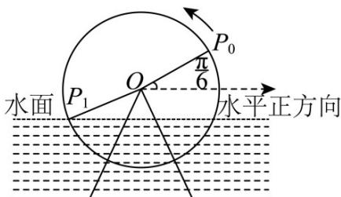

<!-- question-source:start -->
【典例1】如图，水利灌溉工具筒车的转轮中心 $O$ 到水面的距离为 $1\mathrm{m}$ ，筒车的半径是 $3\mathrm{m}$ ，盛水筒的初始位置为 $P_{0}$ ， $OP_{0}$ 与水平正方向的夹角为 $\frac{\pi}{6}$ 。若筒车以角速度 $2\mathrm{rad / min}$ 沿逆时针方向转动， $t$ 为筒车转动后盛水筒第一次到达入水点 $P_{1}$ 所需的时间（单位：min），则（）

A. $t > \frac{\pi}{2}$ B. $\sin t = \frac{\sqrt{2}}{2}$

C. $\cos \left(2t + \frac{\pi}{6}\right) = \frac{2\sqrt{2}}{3}$ D. $\cos \left(4t + \frac{\pi}{3}\right) = \frac{7}{9}$
<!-- question-source:end -->

![[高中/课堂同步/题库/人教A版高中数学同步讲义(2026)/01_必修第一册/第五章 三角函数/专题5.7 三角函数的应用（高效培优讲义）数学人教A版2019高一必修第一册/题型04_三角函数在圆周中的应用/questions/answers/Q00076474A1.md]]
