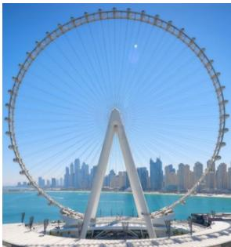
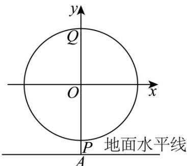

<!-- question-source:start -->
【变式2】如图，某摩天轮最高点距离地面110米，最低点距离地面高度为10米，设置有24个座舱，开启后

按逆时针方向匀速旋转，游客在座舱转到距离地面最近的位置进舱，转一周大约需要30分钟。

(1)以轴心 $O$ 为原点，与地面平行的直线为 $x$ 轴， $PQ$ 所在的直线为 $y$ 轴建立直角坐标系，游客甲坐上摩天轮的

座舱，开始转动 $t$ 分钟后距离地面的高度为 $H$ 米，求 $H$ 关于 $t$ 的函数解析式；

(2)求游客甲从坐上摩天轮之后的一周内，距离地面高度不超过85米的总时长；

(3)若甲、乙两人座舱之间间隔一个座舱，在运行一周的过程中，求两人距离地面的高度差 $h$ （单位：m）关

于 $t$ 的函数解析式，并求高度差的最大值．（精确到个位）

参考公式与数据： $\sin \theta +\sin \varphi = 2\sin \frac{\theta + \varphi}{2}\cos \frac{\theta - \varphi}{2}$ ， $\sin \theta -\sin \varphi = 2\cos \frac{\theta + \varphi}{2}\sin \frac{\theta - \varphi}{2}$ ， $\sqrt{2}\approx 1.41$ ， $\sqrt{3}\approx 1.73$ ：
<!-- question-source:end -->

![[高中/课堂同步/题库/人教A版高中数学同步讲义(2026)/01_必修第一册/第五章 三角函数/专题5.7 三角函数的应用（高效培优讲义）数学人教A版2019高一必修第一册/题型04_三角函数在圆周中的应用/questions/answers/Q00076476A1.md]]
