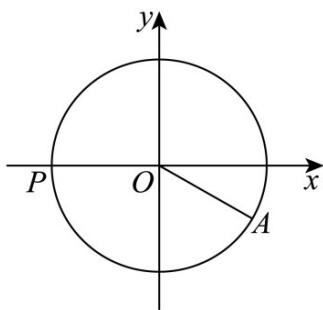

<!-- question-source:start -->
【变式3】水车在古代是进行灌溉引水的工具，是人类的一项古老的发明，也是人类利用自然和改造自然的

象征·如图是一个半径为 R 的水车，一个水斗从点 $A(3\sqrt{3}, -3)$ 出发，沿圆周按逆时针方向匀速旋转，且旋转一

周用时 $^{60}$ 秒·经过 t 秒后，水斗旋转到 P 点，设 P 的坐标为 $(x, y)$ ，其纵坐标满足

$$
y = f (t) = R \sin (\omega t + \varphi) \left(t \quad 0, \omega > 0, | \varphi | <   \frac {\pi}{2}\right).
$$

(1) 求函数 $f(t)$ 的解析式.

(2)当 $t\in [35,55]$ 时，求点 $P$ 到 $x$ 轴的距离的最大值·

(3)当 $t = 20$ 时，求 $\left|PA\right|$ 的大小.
<!-- question-source:end -->

![[高中/课堂同步/题库/人教A版高中数学同步讲义(2026)/01_必修第一册/第五章 三角函数/专题5.7 三角函数的应用（高效培优讲义）数学人教A版2019高一必修第一册/题型04_三角函数在圆周中的应用/questions/answers/Q00076477A1.md]]
