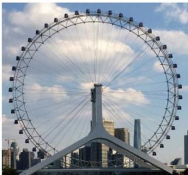
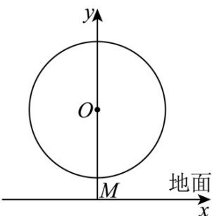

> [!faq]- 《专题5.7 三角函数的应用（高效培优讲义）数学人教A版2019高一必修第一册》官方解析
>
> > [!success]- **【答案】**   A. $H(t) = 77\sin \left(\frac{\pi}{15} t - \frac{\pi}{2}\right) + 83$ B. $H(t) = 77\sin \left(\frac{\pi}{15} t + \frac{\pi}{2}\right) + 83$ C. $H(t) = 77\cos \left(\frac{\pi}{15} t - \frac{\pi}{2}\right) + 83$ D. $H(t) = 77\cos \left(\frac{\pi}{15} t + \frac{\pi}{2}\right) + 83$
>
> > [!note]- **【解析】**
> > 设 $H(t) = A\sin (\omega t + \varphi) + B(\omega >0)$ ，由题意可得 $\left\{ \begin{array}{l}A = 77\\ A + B = 160 \end{array} \right.$ ，解得 $\left\{ \begin{array}{l}A = 77\\ B = 83 \end{array} \right.$ 函数 $H(t)$ 的最小正周期为 $T = 30$ ，则 $\omega = \frac{2\pi}{T} = \frac{\pi}{15}$ 因为游客从最低点 $M$ 处进舱，可取 $\varphi = -\frac{\pi}{2}$
> >
> > 所以 $H(t)=77\sin\left(\frac{\pi}{15}t-\frac{\pi}{2}\right)+83$
> >
> > 故选 **A**.
