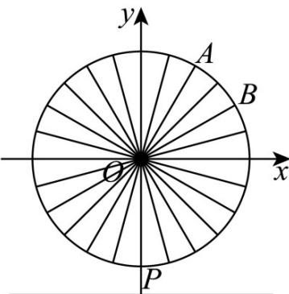

> [!faq]- 《专题5.7 三角函数的应用（高效培优讲义）数学人教A版2019高一必修第一册》官方解析
>
> > [!success]- **【答案】** (1) $H = 50\sin \left(\frac{\pi}{15} t - \frac{\pi}{2}\right) + 60$ ， $0 \leq t \leq 30$ (2) 20 min (3) $h = 100\left|\sin \frac{\pi}{12}\sin \left(\frac{\pi}{15} t - \frac{\pi}{12}\right)\right|\left(0 \leq t \leq 30\right)$ ， $26\mathrm{m}$
>
> > [!note]- **【解析】**
> > （ $^{1}$ ）如图，设座舱距离地面最近的位置为点P，
> >
> > 
> >
> > 以轴心 O 为原点，与地面平行的直线为 x 轴建立直角坐标系。
> >
> > 设 $t = 0\mathrm{min}$ 时，游客甲位于点 $P(0, - 50)$ ，以 $OP$ 为终边的角为 $-\frac{\pi}{2}$
> >
> > 根据摩天轮转一周大约需要 $30\mathrm{min}$ ，可知座舱转动的角速度约 $\frac{\pi}{15}\mathrm{rad / min}$
> >
> > 由题意可得 $H = 50 \sin \left( \frac{\pi}{15} t - \frac{\pi}{2} \right) + 60$ ， $0 \leq t \leq 30$
> >
> > (2) 在运行一周的过程中，由 $0 \leq t \leq 30$ ，则 $-\frac{\pi}{2} \leq \frac{\pi}{15} t - \frac{\pi}{2} \leq \frac{3}{2} \pi$
> >
> > 令 $H = 50 \sin \left( \frac{\pi}{15} t - \frac{\pi}{2} \right) + 60 \leq 85$ ，可得 $\sin \left( \frac{\pi}{15} t - \frac{\pi}{2} \right) \leq \frac{1}{2}$
> >
> > 解得 $0 \leq t \leq 10$ 或者 $20 \leq t \leq 30$
> >
> > 所以游客甲从坐上摩天轮之后，距离地面高度不超过85m的时长为20min。
> >
> > (3) 由甲、乙两人座舱之间间隔一个座舱，如图，甲、乙两人的位置分别用点 A、B 表示，
> >
> > 不妨设点 $B$ 相对于 $\mathrm{A}$ 始终落后，则 $\angle AOB = 2\times \frac{2\pi}{24} = \frac{\pi}{6}$
> >
> > 经过 $t\mathrm{min}$ 后，甲距离地面的高度为 $H_{1} = 50\sin \left(\frac{\pi}{15} t - \frac{\pi}{2}\right) + 60$
> >
> > 点 $B$ 相对于A始终落后 $\frac{\pi}{6} rad$ ，此时乙距离地面的高度 $H_{2} = 50\sin \left(\frac{\pi}{15} t - \frac{2\pi}{3}\right) + 60$
> >
> > 则甲、乙高度差 $h=\left|H_{1}-H_{2}\right|=50\left|\sin\left(\frac{\pi}{15}t-\frac{\pi}{2}\right)-\sin\left(\frac{\pi}{15}t-\frac{2\pi}{3}\right)\right|$
> >
> > 利用 $\sin\theta-\sin\varphi=2\cos\frac{\theta+\varphi}{2}\sin\frac{\theta-\varphi}{2}$
> >
> > 可得 $h=100\left|\cos\left(\frac{\pi}{15}t-\frac{7\pi}{12}\right)\sin\frac{\pi}{12}\right|=100\left|\sin\frac{\pi}{12}\sin\left(\frac{\pi}{15}t-\frac{\pi}{12}\right)\right|(0\leq t\leq30)$
> >
> > 当 $\frac{\pi}{15} t - \frac{\pi}{12} = \frac{\pi}{2}$ 或 $\frac{3\pi}{2}$ ，即 $t = \frac{35}{4}$ 或 $\frac{95}{4}$ ，
> >
> > $$
> > h _ {\max} = 1 0 0 \sin \frac {\pi}{1 2} = 1 0 0 \sin \left(\frac {\pi}{4} - \frac {\pi}{6}\right) = 1 0 0 \left(\sin \frac {\pi}{4} \cos \frac {\pi}{6} - \cos \frac {\pi}{4} \sin \frac {\pi}{6}\right)
> > $$
> >
> > $$
> > = 1 0 0 \times \frac {\sqrt {2}}{2} \times \frac {\sqrt {3} - 1}{2} = 2 5 \sqrt {2} (\sqrt {3} - 1)
> > $$
> >
> > 则将参考数据 $\sqrt{2} \approx 1.41$ ， $\sqrt{3} \approx 1.73$ 代入，
> >
> > $$
> > \mathrm{得} h _ {\max} \approx 2 5 \times 1. 4 1 \times 0. 7 3 = 2 5. 7 3 5 2 \approx 2 6 \mathrm{m}
> > $$
> >
> > 所以甲、乙两人距离地面的高度差的最大值约为 26m·
