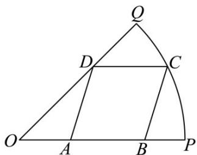

<!-- question-source:start -->
【典例1】为迎接大运会的到来，学校决定在半径为 $20\sqrt{2}\mathrm{m}$ ，圆心角为 $\frac{\pi}{4}$ 的扇形空地 $OPQ$ 的内部修建一平行四边形观赛场地 $ABCD$ ，如图所示·则观赛场地的面积最大值为（）

A. $200\mathrm{m}^2$ B. $400(2 - \sqrt{2})\mathrm{m}^2$ C. $400(\sqrt{3} -1)\mathrm{m}^2$ D. $400(\sqrt{2} -1)\mathrm{m}^2$
<!-- question-source:end -->

![[高中/课堂同步/题库/人教A版高中数学同步讲义(2026)/01_必修第一册/第五章 三角函数/专题5.7 三角函数的应用（高效培优讲义）数学人教A版2019高一必修第一册/题型05_几何中的三角函数模型/questions/answers/Q00076478A1.md]]
