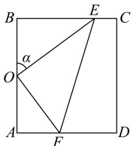

<!-- question-source:start -->
【变式2】一块长方形鱼塘ABCD， $AB=50$ 米， $BC=25\sqrt{3}$ 米，为了便于游客休闲散步，该农庄决定在鱼塘内

建 $^{3}$ 条如图所示的观光走廊 OE, EF, OF，考虑到整体规划，要求 O 是 AB 的中点，点 E 在边 BC 上，点 F 在

边 $AD$ 上，且 $\angle EOF = 90^{\circ}$

(1)设 $\angle BOE = \alpha$ ，试将 $\triangle OEF$ 的周长 $l$ 表示成 $\alpha$ 的函数关系式，并求出此函数的定义域；

(2)经核算，三条走廊每米建设费用均为 $4000$ 元，试问如何设计才能使建设总费用最低并求出最低总费用。
<!-- question-source:end -->

![[高中/课堂同步/题库/人教A版高中数学同步讲义(2026)/01_必修第一册/第五章 三角函数/专题5.7 三角函数的应用（高效培优讲义）数学人教A版2019高一必修第一册/题型05_几何中的三角函数模型/questions/answers/Q00076480A1.md]]
