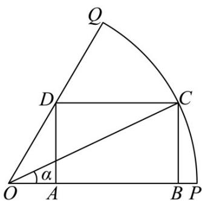

<!-- question-source:start -->
【变式3】如图，已知 $OPQ$ 是半径为 $2$ ，圆心角为 $\frac{\pi}{3}$ 的扇形， $C$ 是扇形弧上的动点， $ABCD$ 是扇形的内接矩

形·记 $\angle POC = \alpha$

(1)用 $\alpha$ 分别表示 $OB, AB$ 的长度：

(2)当 $\alpha$ 为何值时，矩形ABCD的面积最大？并求出这个最大面积
<!-- question-source:end -->

![[高中/课堂同步/题库/人教A版高中数学同步讲义(2026)/01_必修第一册/第五章 三角函数/专题5.7 三角函数的应用（高效培优讲义）数学人教A版2019高一必修第一册/题型05_几何中的三角函数模型/questions/answers/Q00076481A1.md]]
