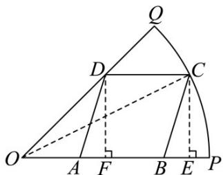

> [!faq]- 《专题5.7 三角函数的应用（高效培优讲义）数学人教A版2019高一必修第一册》官方解析
>
> > [!success]- **【答案】** D
>
> > [!note]- **【解析】**
> > 如图所示：
> >
> > 
> >
> > 连接 $OC$ ，设 $\angle COA = \theta$ ，作 $DF\perp OP$ ， $CE\perp OP$ ，垂足分别为 $F,E$
> >
> > 由四边形 ABCD 是平行四边形，可知 CDFE 为矩形，又 $\angle POQ = \frac{\pi}{4}$ ，则 AB = CD = EF，DF = OF，
> >
> > $$
> > C E = D F
> > $$
> >
> > 于是 $CE = 20\sqrt{2}\sin \theta$ ， $EF = OE - OF = 20\sqrt{2}\cos \theta -20\sqrt{2}\sin \theta$ 因此四边形ABCD的面积S也为四边形DFEC的面积，即有 $S = 20\sqrt{2}\sin \theta \cdot 20\sqrt{2} (\cos \theta -\sin \theta) = 400(\sin 2\theta +\cos 2\theta -1)$ $= 400\sqrt{2}\sin (2\theta +\frac{\pi}{4}) - 400$ ，而 $\theta \in (0,\frac{\pi}{4})$ ，则当 $\theta = \frac{\pi}{8}$ 时， $\sin (2\theta +\frac{\pi}{4}) = 1$ 所以 $S_{\mathrm{max}} = 400(\sqrt{2} -1)\mathrm{m}^2.$
> >
> > 故选 **D**
