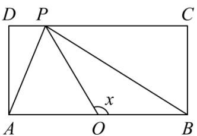
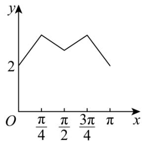
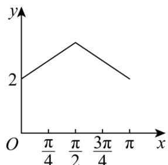
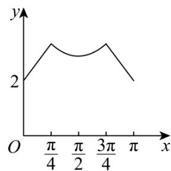
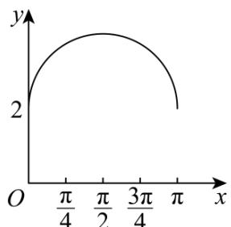

> [!faq]- 《专题5.7 三角函数的应用（高效培优讲义）数学人教A版2019高一必修第一册》官方解析
>
> > [!success]- **【答案】**  A  B C  D  
>
> > [!note]- **【解析】**
> > 由题意可得 $f\left(\frac{\pi}{2}\right) = \sqrt{2} +\sqrt{2} = 2\sqrt{2},f\left(\frac{\pi}{4}\right) = \sqrt{2^2 + 1^2} +1 = \sqrt{5} +1$
> >
> > 故 $f\left(\frac{\pi}{2}\right) < f\left(\frac{\pi}{4}\right)$ ，由此可排除 C、D；
> >
> > 当 $0 < x < \frac{\pi}{4}$ 时点 $P$ 在边 $BC$ 上， $PB = \tan x$ ， $PA = \sqrt{AB^2 + PB^2} = \sqrt{4 + \tan^2 x}$ ，
> >
> > 所以 $f(x)=\tan x+\sqrt{4+\tan^{2}x}$ ，可知 $x\in\left(0,\frac{\pi}{4}\right)$ 时图像不是线段，可排除 A，故选 B.
> >
> > 故选 **B**.
