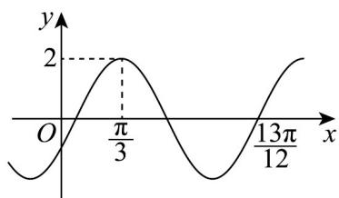

<!-- question-source:start -->
7. 在物理学中简谐运动可以用函数 $f(x) = A\sin (\omega x + \varphi)(A > 0, \omega > 0, |\varphi| < \pi)$ 来表示，其部分图象如图所示，

则下列结论正确的是（）

A．函数 $y = f(x)$ 的图象关于点 $\left(\frac{\pi}{6}, 0\right)$ 成中心对称

B．函数 $y = f(x)$ 的解析式可以为 $f(x) = 2\sin\left(2x - \frac{\pi}{6}\right)$

C. 函数 $y = f(x)$ 在 $[0, \pi]$ 上的值域为 $[0, 2]$

D．若把 $y = f(x)$ 图象上所有的点向右平移 $\frac{\pi}{12}$ 个单位，则所得函数是 $y = 2\sin\left(2x + \frac{\pi}{12}\right)$
<!-- question-source:end -->

![[高中/课堂同步/题库/人教A版高中数学同步讲义(2026)/01_必修第一册/第五章 三角函数/第五章 三角函数（高效培优单元测试·强化卷）数学人教A版2019高一必修第一册/一_选择题/questions/answers/Q00076501A1.md]]
