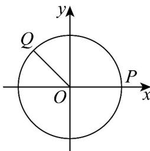

> [!faq]- 《第五章 三角函数（高效培优单元测试·强化卷）数学人教A版2019高一必修第一册》官方解析
>
> > [!success]- **【答案】** D
>
> > [!note]- **【解析】**
> > - **①**：假设命题 p 是真命题，
> >
> > 不妨取 $k = 0$ ，则 $\left|\cos B - \cos A\right| + \left|\cos C - \cos A\right| = 0$ ，则 $\cos A = \cos B = \cos C$
> >
> > 因 $A, B, C \in \left(0, \frac{\pi}{2}\right)$ 且 $A + B + C = \pi$ ，则 $A = B = C = \frac{\pi}{3}$
> >
> > 故存在 $A=\frac{\pi}{3}$ ，对任意 $k\in[0,1]$ ，都存在 VABC 使得 $\left|\cos B-\frac{1}{2}\right|+\left|\cos C-\frac{1}{2}\right|=k$ 成立，
> >
> > 不妨设 0 < B < A = $\frac{\pi}{3} < C < \frac{\pi}{2}$ (B, C 不可能同时小于或大于 $\frac{\pi}{3}$ )，
> >
> > $$
> > \left| \cos B - \frac {1}{2} \right| + \left| \cos C - \frac {1}{2} \right| = \cos B - \frac {1}{2} + \frac {1}{2} - \cos C = \cos B - \cos C = \cos B + \cos \left(B + \frac {\pi}{3}\right)
> > $$
> >
> > $$
> > = \cos B + \frac {1}{2} \cos B - \frac {\sqrt {3}}{2} \sin B = \sqrt {3} \cos \left(B + \frac {\pi}{6}\right)
> > $$
> >
> > 因 $0 < B < \frac{\pi}{3}, \frac{\pi}{3} < C = \frac{2\pi}{3} - B < \frac{\pi}{2}$ ，得 $\frac{\pi}{6} < B < \frac{\pi}{3}$ ，则 $\frac{\pi}{3} < B + \frac{\pi}{6} < \frac{\pi}{2}$ ，
> >
> > 则 $k = \sqrt{3}\cos \left(B + \frac{\pi}{6}\right)\in \left(0,\frac{\sqrt{3}}{2}\right)$
> >
> > 则对于 $k \in \left[\frac{\sqrt{3}}{2}, 1\right]$ ， $\left|\cos B - \cos A\right| + \left|\cos C - \cos A\right| = k$ 不成立，
> >
> > 故假设不成立，命题 p 为假命题；
> > - **②**：取 $A = \frac{\pi}{6}$ ，则 $B + C = \frac{5\pi}{6}$ ，因为 $A, B, C$ 为锐角， $\therefore B = \frac{5\pi}{6} - C < \frac{\pi}{2}, \therefore \frac{\pi}{3} < C < \frac{\pi}{2}$ ，
> >
> > 同理 $\frac{\pi}{3} < B < \frac{\pi}{2}$ 。所以， $A < B, A < C$ 。
> >
> > 此时，记 $f(C) = |\cos B - \cos A| + |\cos C - \cos A| = 2\cos A - \cos B - \cos C$
> >
> > $$
> > = \sqrt {3} - \cos \left(\frac {5 \pi}{6} - C\right) - \cos C = \sqrt {3} + \left(\frac {\sqrt {3}}{2} - 1\right) \cos C - \frac {1}{2} \sin C
> > $$
> >
> > $$
> > = \sqrt {3} - \frac {1}{2} [ (2 - \sqrt {3}) \cos C + \sin C ] = \sqrt {3} - \frac {\sqrt {6} - \sqrt {2}}{2} \sin (C + \varphi)
> > $$
> >
> > 其中 $\tan\varphi=2-\sqrt{3}$ ，所以可取 $\varphi=\frac{\pi}{12}$ ，
> >
> > $$
> > \because \frac {\pi}{3} <   C <   \frac {\pi}{2}, \therefore \frac {5 \pi}{1 2} <   C + \frac {\pi}{1 2} <   \frac {7 \pi}{1 2}
> > $$
> >
> > 所以 $\sin\left(C+\frac{\pi}{12}\right)\leq1,\quad f(C)\quad\sqrt{3}-\frac{\sqrt{6}-\sqrt{2}}{2}>1\quad k,$
> >
> > 其中 $\frac{\sqrt{6} - \sqrt{2}}{2} < \frac{2.5 - 1.4}{2} = 0.55$
> >
> > 这就是说，当 $A = \frac{\pi}{6}$ 时，不存在VABC，使得 $|\cos B - \cos A| + |\cos C - \cos A| = k$ 成立，所以 $q$ 是假命题
> >
> > 故选：D.
> >
> > ## 二、选择题：本题共3小题，每小题6分，共18分．在每小题给出的选项中，有多项符合题目要求．全部
> >
> > 选对的得 6 分，部分选对的得部分分，有选错的得 0 分.
> >
> > 9. 质点 $P$ 和 $Q$ 在以坐标原点 $O$ 为圆心，半径为 1 的 $\odot O$ 上逆时针做匀速圆周运动，同时出发 $\cdot P$ 的角速度大小为 $1\mathrm{rad / s}$ ，起点为 $\odot O$ 与 $x$ 轴正半轴的交点； $Q$ 的角速度大小为 $3\mathrm{rad / s}$ ，起点为射线 $y = -x(x \leq 0)$ 与$\odot O$ 的交点·则当 $Q$ 与 $P$ 重合时， $Q$ 的坐标可以为（）
> >
> > 【答案】
> >
> > A. $\left(\cos\frac{\pi}{8},\sin\frac{\pi}{8}\right)$ B. $\left(\cos\frac{3\pi}{8},-\sin\frac{3\pi}{8}\right)$ C. $\left(\cos\frac{5\pi}{8},\sin\frac{5\pi}{8}\right)$ D. $\left(\cos\frac{7\pi}{8},\sin\frac{7\pi}{8}\right)$
> >
> > 【答案】BC
> >
> > 【详解】点 $Q$ 的初始位置 $Q_{1}$ 的坐标为 $\left(-\frac{\sqrt{2}}{2},\frac{\sqrt{2}}{2}\right)$ ，且钝角 $\angle POQ = \frac{3\pi}{4}$
> >
> > 
> >
> > 设经过 $t^s$ 后， $Q$ 与 $P$ 重合，坐标均为 $(\cos t, \sin t)$
> >
> > 则 $3t = t + \frac{5\pi}{4} + 2k\pi, k \in \mathbb{Z}$ ，解得 $t = \frac{5\pi}{8} + k\pi, k \in \mathbb{N}$
> >
> > 当 $k$ 为偶数时， $Q$ 的坐标为 $\left(\cos \frac{5\pi}{8}, \sin \frac{5\pi}{8}\right)$ ，C 正确；
> >
> > 当 $k$ 为奇数时， $Q$ 的坐标为 $\left(\cos \frac{13\pi}{8}, \sin \frac{13\pi}{8}\right)$ ，即 $\left(\cos \frac{3\pi}{8}, -\sin \frac{3\pi}{8}\right)$ ，B 正确；
> >
> > AD 均不对，
> >
> > 故选 **BC**
